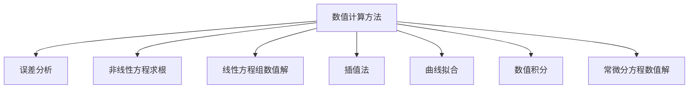

# 数值计算方法

> 📚 杨一都、闭海、王世喜编著 · 第二版

## 快速开始

| 文件 | 说明 |
|------|------|
| [[笔记生成指南]] | 笔记格式、模板、规则 |
| [[生成指令]] | 快速生成笔记的指令 |
| [[页码索引]] | 所有小节的页码范围 |

## 目录结构

## 各章目录

- [[第一章 绪论]]
- [[第二章 误差分析]]
- [[第三章 非线性方程求根]]
- [[第四章 线性方程组的直接解法]]
- [[第五章 线性方程组的迭代解法]]
- [[第六章 插值法]]
- [[第七章 曲线拟合]]
- [[第八章 数值积分]]
- [[第九章 常微分方程数值解法]]

---

#学习笔记 #数值计算 #计算方法
