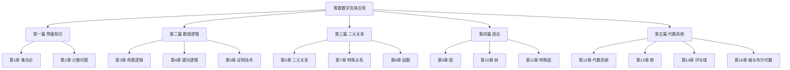

# 离散数学及其应用

> 📚 笔记整理中...

## 目录结构

## 第一篇 预备知识
- [[第1章 集合论]]
- [[第2章 计数问题]]

## 第二篇 数理逻辑
- [[第3章 命题逻辑]]
- [[第4章 谓词逻辑]]
- [[第5章 证明技术]]

## 第三篇 二元关系
- [[第6章 二元关系]]
- [[第7章 特殊关系]]
- [[第8章 函数]]

## 第四篇 图论
- [[第9章 图]]
- [[第10章 树]]
- [[第11章 特殊图]]

## 第五篇 代数系统
- [[第12章 代数系统]]
- [[第13章 群]]
- [[第14章 环与域]]
- [[第15章 格与布尔代数]]

---
#学习笔记 #离散数学
