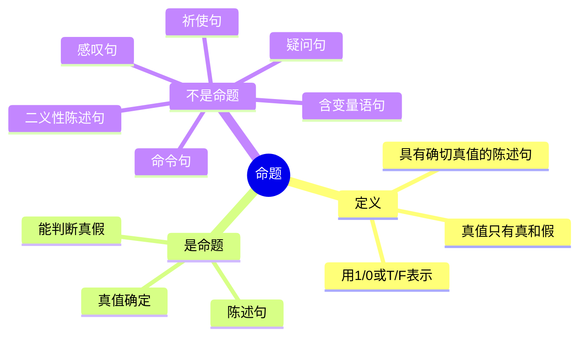

---
aliases:
  - 命题
  - Proposition
  - 陈述句
---

# 3.2.1 命题

> [!abstract] 概述
> 数理逻辑研究的中心问题是推理，而推理的前提和结论都是表达判断的陈述句，因而表达判断的陈述句构成了推理的基本单位。

**所属**：[[3.2 命题与命题联结词]] | [[第3章 命题逻辑]]

---

## 一、命题的定义（重点 ★★★）

> [!definition] 定义3.2.1
> **具有确切真值的陈述句**称为**命题**(proposition)。
>
> 该命题可以取一个"值"，称为**真值**。真值只有"**真**"和"**假**"两种，分别用：
> - "**1**"（或"T"）表示真
> - "**0**"（或"F"）表示假

> [!important] 理解要点
> 命题逻辑研究的对象是**命题**。
>
> 从定义可知，一切没有判断内容的句子都不能作为命题，包括：
> - 命令句
> - 感叹句
> - 疑问句
> - 祈使句
> - 二义性的陈述句

---

## 二、例题：判断命题（重点 ★★★）

> [!example] 例3.2.1 判断下列语句哪些是命题。如果是命题，其真值结果如何？
>
> | 序号 | 语句 | 是否为命题 | 真值/原因 |
> |:----:|:----:|:----------:|:---------:|
> | (1) | 太阳是圆的 | ✅ 是 | 真值为"真" |
> | (2) | 成都是一个旅游城市 | ✅ 是 | 真值为"真" |
> | (3) | 北京是中国的首都 | ✅ 是 | 真值为"真" |
> | (4) | 这个语句是假的 | ❌ 不是 | 悖论，二义性 |
> | (5) | 1+1=10 | ✅ 是 | 需根据实际情况（二进制下为真）|
> | (6) | x+y>0 | ❌ 不是 | 含变量，无法判断 |
> | (7) | 我喜欢踢足球 | ✅ 是 | 需根据实际情况而定 |
> | (8) | 3能被2整除 | ✅ 是 | 真值为"假" |
> | (9) | 地球外的星球上也有人 | ✅ 是 | 需根据实际情况而定 |
> | (10) | 中国是世界上人口最多的国家 | ✅ 是 | 真值为"真" |
> | (11) | 今天是晴天 | ✅ 是 | 需根据实际情况而定 |
> | (12) | 把门关上 | ❌ 不是 | 祈使句 |
> | (13) | 出去！ | ❌ 不是 | 祈使句 |
> | (14) | 你要出去吗？ | ❌ 不是 | 疑问句 |
> | (15) | 今天天气真好啊！ | ❌ 不是 | 感叹句 |

---

## 三、命题的特点（重点 ★★）

> [!summary] 例题结论
> 从上述例子可知：
>
> 1. **命题一定是通过陈述句来表达的**
> 2. **反之，并非一切陈述句都一定是命题**

### 3.1 真值的确定

> [!important] 两种情况
> 当一个陈述句描述的是：
> - **存在的事实**或**永恒的真理** → 有确切的真值
> - 其他情况 → 需依靠环境、条件、时间、实际情况等才能确定其真值

### 3.2 真值的客观性

> [!warning] 重要区别
> 一个语句**本身是否能分辨真假**与**人们是否知道它的真假**是两回事。
>
> 也就是说，对于一个语句，有时人们可能无法判断它的真假，但这个语句本身却是有真假的。

---

## 四、不是命题的情况

> [!summary] 不能作为命题的句子类型

| 句子类型 | 示例 | 原因 |
|:--------:|:----:|:----:|
| 命令句 | 把门关上 | 没有判断内容 |
| 祈使句 | 出去！ | 没有判断内容 |
| 疑问句 | 你要出去吗？ | 没有判断内容 |
| 感叹句 | 今天天气真好啊！ | 没有判断内容 |
| 二义性陈述句 | 这个语句是假的 | 悖论，无法确定真值 |
| 含变量语句 | x+y>0 | 无法判断真假 |

---

## 五、本节总结

---

#离散数学 #命题逻辑 #命题 #重点
