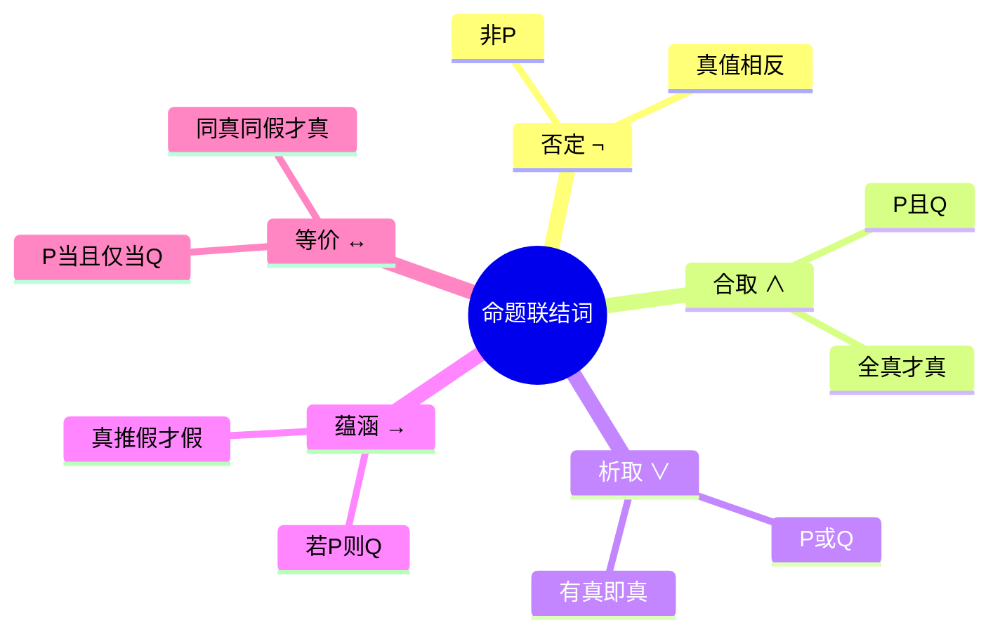

---
aliases:
  - 逻辑联结词
  - 联结词
  - 真值联结词
---

# 3.2.2 命题联结词

> [!abstract] 概述
> 命题联结词是将简单命题组合成复合命题的逻辑符号。在语言中，最常见的联结词主要有5种："或者""并且""不""如果……则……""当且仅当"。

**所属**：[[3.2 命题与命题联结词]] | [[第3章 命题逻辑]]

---

## 一、否定联结词 ¬

> [!definition] 定义3.2.2
> 设 $P$ 是任一命题，复合命题"**非 $P$**"（或"$P$ 的否定"）称为 $P$ 的**否定式**(negation)，记作 $\neg P$，"$\neg$"为**否定联结词**。
>
> **真值规则**：$\neg P$ 的真值为"真"**当且仅当** $P$ 的真值为"假"。

> [!example] 例题
> 设 $P$：四川是一个国家。
>
> 则 $\neg P$：四川不是一个国家。
>
> 四川的确不是一个国家，所以 $\neg P$ 的真值为"真"。

---

## 二、合取联结词 ∧

> [!definition] 定义3.2.3
> 设 $P, Q$ 是任两个命题，复合命题"**$P$ 并且 $Q$**"（或"$P$ 和 $Q$"）称为 $P$ 与 $Q$ 的**合取式**(conjunction)，记作 $P \land Q$，"$\land$"为**合取联结词**。
>
> **真值规则**：$P \land Q$ 的真值为"真"**当且仅当** $P, Q$ 的真值**同为"真"**。

> [!example] 例题
> 设 $P$：3 是素数。
> 设 $Q$：3 是奇数。
>
> 则 $P \land Q$：3 既是素数又是奇数。
>
> 3 的确为素数，也是奇数，所以 $P \land Q$ 的真值为"真"。

---

## 三、析取联结词 ∨

> [!definition] 定义3.2.4
> 设 $P, Q$ 是任意两个命题，复合命题"**$P$ 或 $Q$**"称为 $P$ 与 $Q$ 的**析取式**(disjunction)，记作 $P \lor Q$，"$\lor$"为**析取联结词**。
>
> **真值规则**：$P \lor Q$ 的真值为"真"**当且仅当** $P, Q$ 中**至少有一个**真值为"真"。

> [!example] 例题
> 设 $P$：张谦是大学生。
> 设 $Q$：张谦是运动员。
>
> 则 $P \lor Q$：张谦是大学生或是运动员。
>
> $P \lor Q$ 的真值视张谦是否是大学生或者是运动员的具体情况而定。

> [!warning] 可兼或 vs 不可兼或
> - **可兼或**（$\lor$）：对应析取联结词，两者可以同时为真
> - **不可兼或**（$\overline{\lor}$）：两者不能同时为真
>
> **例**：
> - 张明明明天早上 9 点飞机到北京**或者**到上海（不可兼或）
> - 我喜欢学习**或**喜欢音乐（可兼或）

---

## 四、蕴涵联结词 →

> [!definition] 定义3.2.5
> 设 $P, Q$ 是任意两个命题，复合命题"**如果 $P$，则 $Q$**"称为 $P$ 与 $Q$ 的**蕴涵式**(implication)，记作 $P \to Q$，"$\to$"为**蕴涵联结词**。
> - $P$ 称为蕴涵式的**前件**
> - $Q$ 称为蕴涵式的**后件**
>
> **真值规则**：$P \to Q$ 的真值为"假"**当且仅当** $P$ 的真值为"真"**且** $Q$ 的真值为"假"。

> [!example] 例题
> 设 $P$：周末天气晴朗。
> 设 $Q$：我们将到郊外旅游。
>
> 则 $P \to Q$：如果周末天气晴朗，则我们将到郊外旅游。
>
> **分析**：
> - 若周末确实天气晴朗（$P$为真），且我们去了郊游（$Q$为真）→ $P \to Q$ 为真
> - 若周末确实天气晴朗（$P$为真），但我们没去郊游（$Q$为假）→ $P \to Q$ 为假
> - 若周末天气不晴朗（$P$为假），无论是否去郊游 → $P \to Q$ 为真

> [!important] 理解要点
> 由定义可知，如果 $P$ 是**假命题**，那么不管 $Q$ 的真值是"真"还是"假"，命题"如果 $P$，那么 $Q$"在命题逻辑中都被认为是**真命题**。

---

## 五、等价联结词 ↔

> [!definition] 定义3.2.6
> 设 $P, Q$ 是任意两个命题，复合命题"**$P$ 当且仅当 $Q$**"称为 $P$ 与 $Q$ 的**等价式**(equivalence)，记作 $P \leftrightarrow Q$，"$\leftrightarrow$"为**等价联结词**。
>
> **真值规则**：$P \leftrightarrow Q$ 的真值为"真"**当且仅当** $P, Q$ 的真值**同为"真"或同为"假"**。

> [!example] 例题
> 设 $P$：$2+2=4$。
> 设 $Q$：雪是白的。
>
> 则 $P \leftrightarrow Q$：$2+2=4$ 当且仅当雪是白的。
>
> **分析**：$2+2=4$ 为真，雪的确是白的，$Q$ 也为真，所以 $P \leftrightarrow Q$ 的真值为"真"。

---

## 六、联结词归纳表（重点 ★★★）

> [!summary] 表3.2.1 联结词归纳

| 联结词 | 记号 | 复合命题 | 读法 | 记法 | 真值结果 |
|:------:|:----:|:--------:|:----:|:----:|:--------:|
| 否定 | $\neg$ | $P$ 的否定 | 非 $P$ | $\neg P$ | $\neg P$ 为真当且仅当 $P$ 为假 |
| 合取 | $\land$ | $P$ 并且 $Q$ | $P$ 合取 $Q$ | $P \land Q$ | $P \land Q$ 为真当且仅当 $P, Q$ 同为真 |
| 析取 | $\lor$ | $P$ 或者 $Q$ | $P$ 析取 $Q$ | $P \lor Q$ | $P \lor Q$ 为真当且仅当 $P, Q$ 至少一个为真 |
| 蕴涵 | $\to$ | 若 $P$ 则 $Q$ | $P$ 蕴涵 $Q$ | $P \to Q$ | $P \to Q$ 为假当且仅当 $P$ 为真且 $Q$ 为假 |
| 等价 | $\leftrightarrow$ | $P$ 当且仅当 $Q$ | $P$ 等价 $Q$ | $P \leftrightarrow Q$ | $P \leftrightarrow Q$ 为真当且仅当 $P, Q$ 同真或同假 |

---

## 七、真值表（重点 ★★★）

> [!summary] 表3.2.2 五种联结词真值表

| $P$ | $Q$ | $\neg P$ | $P \land Q$ | $P \lor Q$ | $P \to Q$ | $P \leftrightarrow Q$ |
|:---:|:---:|:--------:|:-----------:|:----------:|:---------:|:---------------------:|
| 0 | 0 | **1** | 0 | 0 | 1 | 1 |
| 0 | 1 | **1** | 0 | 1 | 1 | 0 |
| 1 | 0 | **0** | 0 | 1 | **0** | 0 |
| 1 | 1 | **0** | **1** | 1 | 1 | 1 |

---

## 八、联结词的优先级

> [!important] 优先级规则（从高到低）
> $$\neg \to \land \to \lor \to \to \to \leftrightarrow$$
>
> 即：**否定 → 合取 → 析取 → 蕴涵 → 等价**

**补充规则**：
1. 同级的联结词，按其出现的先后为序（从左到右）
2. 若运算要求与优先次序不一致，可使用**括号**
3. 括号中运算的优先级**最高**

---

## 九、联结词的难点（重点 ★★）

> [!warning] 注意以下几点

**（1）否定联结词"¬"**
- 是自然语言中的"**非**""**不**"和"**没有**"等的逻辑抽象

**（2）合取联结词"∧"**
- 是自然语言中的"**并且**""**既……又……**""**但**""**和**"等的逻辑抽象

**（3）析取联结词"∨"**
- 是自然语言中的"**或**""**或者**"的逻辑抽象
- 注意区分"**可兼或**"和"**不可兼或**"

**（4）蕴涵联结词"→"**
- 往往不易分清它的**前件和后件**
- 常将 $P \to Q$ 写成 $Q \to P$
- 分不清命题的**必要条件**、**充分条件**和**充分必要条件**

> [!tip] 蕴涵的常见描述方法
> $Q$ 是 $P$ 的必要条件有多种描述方法：
> 1. 因为 $P$ 所以 $Q$
> 2. 只要 $P$ 就 $Q$
> 3. 只有 $Q$ 才有 $P$
> 4. 除非 $Q$ 否则非 $P$

---

## 十、例题：符号化命题

> [!example] 例3.2.3 符号化下列命题

**（1）四川不是人口最多的省份。**

解 设 $P$：四川是人口最多的省份。
则 $\neg P$：四川不是人口最多的省份。

**（2）王超是一个德智体全面发展的好学生。**

解 设 $P$：王超是一个思想品德好的学生。
$Q$：王超是一个学习成绩好的学生。
$R$：王超是一个体育成绩好的学生。
则 $P \land Q \land R$：王超是一个德智体全面发展的好学生。

**（3）计算机不能正常启动的原因可能是主板坏了或是电源线接触不良。**

解 设 $P$：计算机不能正常启动的原因可能是主板坏了。
$Q$：计算机不能正常启动的原因可能是电源线接触不良。
则 $P \lor Q$：计算机不能正常启动的原因可能是主板坏了或是电源线接触不良。

**（4）如果周末天气晴朗，那么学院将组织我们到石像湖春游。**

解 设 $P$：周末天气晴朗。
$Q$：学院将组织我们到石像湖春游。
则 $P \to Q$：如果周末天气晴朗，那么学院将组织我们到石像湖春游。

**（5）两个三角形全等当且仅当三角形的三条边全部相等。**

解 设 $P$：两个三角形全等。
$Q$：三角形的三条边全部相等。
则 $P \leftrightarrow Q$：两个三角形全等当且仅当三角形的三条边全部相等。

---

## 十一、本节总结

---

#离散数学 #命题逻辑 #联结词 #重点
