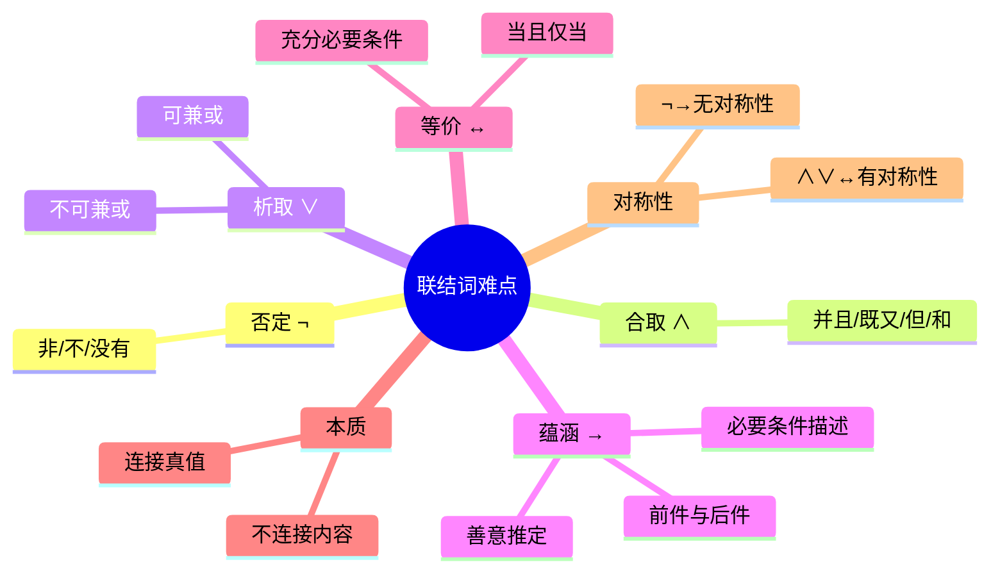

---
aliases:
  - 联结词注意事项
  - 联结词使用要点
---

# 3.2.3 联结词的难点

> [!abstract] 概述
> 使用5种联结词时需要注意的难点和易错点，特别是蕴涵联结词的前件与后件区分、必要条件与充分条件的辨析。

**所属**：[[3.2 命题与命题联结词]] | [[第3章 命题逻辑]]

---

## 一、五种联结词的语言对应（重点 ★★★）

> [!summary] 联结词与自然语言的对应关系

| 联结词 | 自然语言表达 |
|:------:|:------------:|
| $\neg$ | "非""不""没有" |
| $\land$ | "并且""既……又……""但""和" |
| $\lor$ | "或""或者" |
| $\to$ | "如果……则……""只要……就……" |
| $\leftrightarrow$ | "充分必要条件""当且仅当" |

---

## 二、各联结词的难点分析

### 2.1 否定联结词 ¬

> [!note] 要点
> 联结词"$\neg$"是自然语言中的"**非**""**不**"和"**没有**"等的逻辑抽象。

### 2.2 合取联结词 ∧

> [!note] 要点
> 联结词"$\land$"是自然语言中的"**并且**""**既……又……**""**但**""**和**"等的逻辑抽象。

### 2.3 析取联结词 ∨

> [!warning] 重点：可兼或 vs 不可兼或
> 联结词"$\lor$"是自然语言中的"或""或者"的逻辑抽象。
>
> 但"或"有两种含义：
> - **可兼或**（$\lor$）：两者可以同时为真
> - **不可兼或**（$\overline{\lor}$）：两者不能同时为真

> [!example] 示例
> - **不可兼或**：张明明明天早上9点飞机到北京**或者**到上海
>   - （不能同时到达两地）
> - **可兼或**：我喜欢学习**或**喜欢音乐
>   - （可以同时喜欢两者）

### 2.4 蕴涵联结词 →（难点 ★★★）

> [!warning] 常见错误
> 对于联结词"$\to$"，往往不易分清它的**前件和后件**，即常将 $P \to Q$ 写成 $Q \to P$，分不清命题的**必要条件**、**充分条件**和**充分必要条件**。

> [!important] $Q$ 是 $P$ 的必要条件的描述方法
> $Q$ 是 $P$ 的必要条件有多种描述方法：
>
> | 序号 | 描述 | 符号化 |
> |:----:|:----:|:------:|
> | ① | 因为 $P$ 所以 $Q$ | $P \to Q$ |
> | ② | 只要 $P$ 就 $Q$ | $P \to Q$ |
> | ③ | $P$ 仅当 $Q$ | $P \to Q$ |
> | ④ | 只有 $Q$，才 $P$ | $P \to Q$ |
> | ⑤ | 除非 $Q$，才 $P$ | $P \to Q$ |
> | ⑥ | 除非 $Q$，否则 $\neg P$ | $P \to Q$ |
> | ⑦ | 没有 $Q$，就没有 $P$ | $P \to Q$ |

> [!example] 例题：命题符号化
> 设 $P$：雪是白色的；$Q$：$2+2=4$。将下列命题符号化：
>
> | 命题 | 符号化 |
> |:----:|:------:|
> | ① 因为雪是白色的，所以 $2+2=4$ | $P \to Q$ |
> | ② 如果 $2+2=4$，则雪是白色的 | $Q \to P$ |
> | ③ 只有雪是白色的，才有 $2+2=4$ | $Q \to P$ |
> | ④ 只有 $2+2=4$，雪才是白色的 | $P \to Q$ |
> | ⑤ 只要雪不是白色的，就有 $2+2=4$ | $\neg P \to Q$ |
> | ⑥ 除非雪是白色的，否则 $2+2 \neq 4$ | $\neg P \to \neg Q$ 或 $Q \to P$ |
> | ⑦ 雪是白的当且仅当 $2+2=4$ | $P \leftrightarrow Q$ |

### 2.5 等价联结词 ↔

> [!note] 要点
> 双条件联结词"$\leftrightarrow$"是自然语言中的"**充分必要条件**""**当且仅当**"等的逻辑抽象。

---

## 三、善意推定（重点 ★★）

> [!important] 善意推定
> 在自然语言中，前件为假，不管后件真假，整个语句的意义往往无法判断。
>
> 但在**数理逻辑**中，当前件 $P$ 的真值为"假"时，不管后件 $Q$ 真值的"真""假"如何，$P \to Q$ 的真值都为"**真**"。
>
> 此时称为"**善意推定**"。

> [!warning] 注意
> 在自然语言中，条件式前提和结论之间必含有某种**因果关系**。
>
> 但在**数理逻辑**中可以允许两者**无必然因果关系**，也就是说并不要求前件和后件的内容有什么直接联系。

---

## 四、联结词的本质

> [!important] 核心要点（重点 ★★★）
> **联结词连接的是两个命题真值之间的联结，而不是命题内容之间的连接**。
>
> 因此：
> - 复合命题的真值只取决于构成它们的各原子命题的真值
> - 与它们的内容、含义无关
> - 与联结词所连接的两原子命题之间是否有关系无关

> [!example] 示例
> 命题："雪是白的当且仅当北京是中国的首都"
>
> - "雪是白的"与"北京是中国的首都"在内容上**毫无相关**
> - 但其真值的确**相同**（都为真）
> - 所以该语句的真值结果为"**真**"

---

## 五、联结词的对称性

> [!summary] 对称性分析

| 联结词 | 对称性 | 说明 |
|:------:|:------:|:----:|
| $\land$ | **有对称性** | $P \land Q$ 与 $Q \land P$ 等价 |
| $\lor$ | **有对称性** | $P \lor Q$ 与 $Q \lor P$ 等价 |
| $\leftrightarrow$ | **有对称性** | $P \leftrightarrow Q$ 与 $Q \leftrightarrow P$ 等价 |
| $\neg$ | **无对称性** | 一元运算 |
| $\to$ | **无对称性** | $P \to Q$ 与 $Q \to P$ 不等价 |

---

## 六、联结词与计算机电路

> [!note] 应用
> 联结词"$\land$""$\lor$""$\neg$"与计算机的"**与**"门、"**或**"门和"**非**"门电路是相对应的。
>
> 从而**命题逻辑是计算机硬件电路表示、分析和设计的重要工具**。

---

## 七、本节总结

---

#离散数学 #命题逻辑 #联结词 #重点
