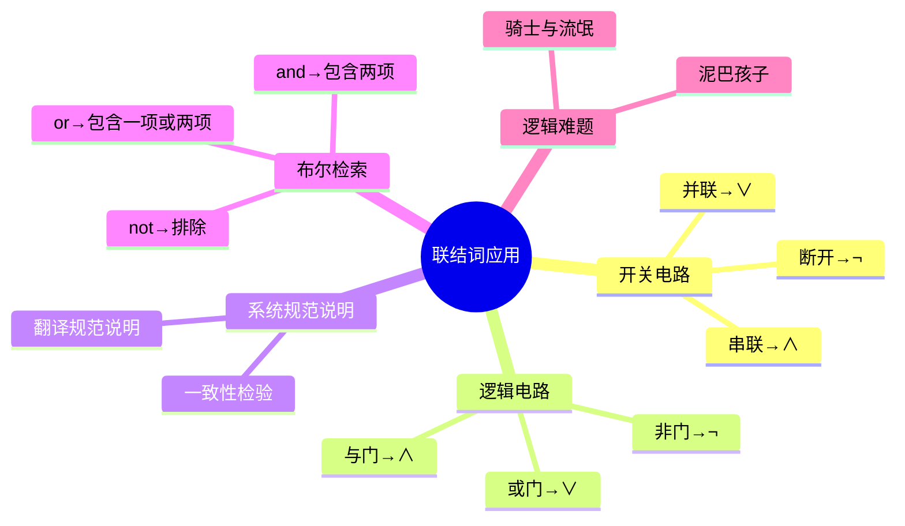

---
aliases:
  - 联结词应用
  - 命题符号化应用
---

# 3.2.4 命题联结词的应用

> [!abstract] 概述
> 命题联结词在实际中有广泛的应用，包括开关电路、逻辑电路、系统规范说明、布尔检索和逻辑难题等。

**所属**：[[3.2 命题与命题联结词]] | [[第3章 命题逻辑]]

---

## 一、开关电路（例3.2.7）

> [!example] 例3.2.7 用复合命题表示开关电路
> **设** $P$：开关 $P$ 闭合；$Q$：开关 $Q$ 闭合。

### 1.1 串联电路

> [!note] 分析
> 只有当命题 $P$ 和 $Q$ 都为真，即开关 $P$ 和 $Q$ 都闭合时，连接在电路上的灯泡才亮。

**结论**：串联电路可用 $P \land Q$ 表示

### 1.2 并联电路

**结论**：并联电路可用 $P \lor Q$ 表示

### 1.3 断开开关

> [!note] 分析
> 命题 $P$ 为真表示开关 $P$ 闭合，命题 $\neg P$ 表示开关 $P$ 断开。

> [!summary] 开关电路对应关系
> | 电路类型 | 命题公式 |
> |:--------:|:--------:|
> | 串联 | $P \land Q$ |
> | 并联 | $P \lor Q$ |
> | 断开 | $\neg P$ |

---

## 二、逻辑电路（例3.2.8）

> [!example] 例3.2.8 用复合命题表示逻辑电路
> **设** $P$：输入端 $P$ 为高电位；$Q$：输入端 $Q$ 为高电位。

### 2.1 与门

> [!note] 分析
> 只有当命题 $P$ 和 $Q$ 都为真，即输入端 $P$ 和 $Q$ 都为高电位时，输出端才是高电位。

**结论**：与门可用 $P \land Q$ 表示

### 2.2 或门

> [!note] 分析
> 只有当命题 $P$ 为真或 $Q$ 为真，即输入 $P$ 为高电位或 $Q$ 为高电位时，其输出端才为高电位。

**结论**：或门可用 $P \lor Q$ 表示

### 2.3 非门

> [!note] 分析
> 命题 $P$ 为真表示输入端 $P$ 为高电位，而通过反相器可得到另一相反的电位，相反电位可用 $\neg P$ 表示。

**结论**：非门可用 $\neg P$ 表示

> [!summary] 逻辑电路对应关系
> | 逻辑门 | 命题公式 |
> |:------:|:--------:|
> | 与门 | $P \land Q$ |
> | 或门 | $P \lor Q$ |
> | 非门 | $\neg P$ |

---

## 三、系统规范说明（例3.2.9-3.2.11）

> [!important] 背景
> 在计算机处理日常事务时，如何将自然语言翻译成逻辑表达式是很重要的一部分。
>
> 系统和软件工程师从自然语言中提取需求，生成**精确、无二义性的规范说明**，这些说明可作为系统开发的基础。

### 3.1 规范说明翻译（例3.2.9）

> [!example] 例3.2.9
> 使用逻辑联结词表示规范说明"**当文件系统满时，自动应答不能够发出**"。
>
> **分析**：
> - 设 $P$：自动应答能够发出
> - $Q$：文件系统满了
> - $\neg P$：自动应答不能够发出
>
> **解**：该规范说明可以用蕴涵式 $Q \to \neg P$ 来表示。

### 3.2 规范说明一致性（例3.2.10）

> [!warning] 重要概念
> 系统规范说明不应该包含有**冲突的需求**。若有，则无法开发出满足所有规范说明的系统。
>
> 表示这些规范说明的命题表达式应该是**一致的**，也就是说，对表达式中的各个变量，必然有一个真值赋值使所有表达式为真。

> [!example] 例3.2.10 确定系统规范说明是否一致
> 规范说明：
> 1. "诊断消息存储在缓冲区中或是被重传"
> 2. "诊断消息没有存储在缓冲区中"
> 3. "如果诊断消息存储在缓冲区中，那么它将被重传"
>
> **分析**：
> - 设 $P$：诊断消息存储在缓冲区中
> - $Q$：诊断消息被重传
> - 三个规范说明：$P \lor Q$，$\neg P$，$P \to Q$
>
> **解**：
> 1. 从 $\neg P$ 为真 → $P$ 必须为假
> 2. 要使 $P \lor Q$ 为真，因为 $P$ 为假，所以 $Q$ 必须为真
> 3. 当 $P$ 为假、$Q$ 为真时，$P \to Q$ 为真
>
> **结论**：当 $P$ 为假，$Q$ 为真时，这些规范说明是**一致的**。

### 3.3 不一致的规范说明（例3.2.11）

> [!example] 例3.2.11
> 在例3.2.10中加上一个系统规范说明"诊断消息不被重传"（$\neg Q$），它们还能保持一致吗？
>
> **解**：
> - 例3.2.10中，只有当 $P$ 为假且 $Q$ 为真时那三个规范说明才为真
> - 新增规范说明 $\neg Q$，此时 $\neg Q$ 为假
>
> **结论**：这4个规范说明**不是一致的**。

---

## 四、布尔检索（例3.2.12）

> [!note] 概念
> 逻辑联结词广泛用于大量的信息检索中，例如检索网页索引。由于这些检索使用来自命题逻辑的技术，所以称为**布尔检索**。

### 4.1 布尔检索的联结词

> [!summary] 联结词在布尔检索中的含义
> | 联结词 | 作用 |
> |:------:|:----:|
> | $\land$ (and) | 匹配包含**两个**检索项的记录 |
> | $\lor$ (or) | 匹配**两个检索项之一**或**两项均匹配**的记录 |
> | $\neg$ (not) | **排除**某个特定的检索项 |

### 4.2 网页检索示例（例3.2.12）

> [!example] 例3.2.12 网页检索
> 用布尔检索找出关于：
> 1. 新墨西哥州（New Mexico）各大学的网页
> 2. 与新墨西哥州或亚利桑那州（Arizona）的大学有关的网页
> 3. 有关墨西哥（不是新墨西哥州）新建立的大学的网页
>
> **解**：
>
> | 目标 | 检索式 | 说明 |
> |:----:|:------:|:----:|
> | 新墨西哥州大学 | `New and Mexico and universities` | 包含三个词的网页 |
> | 新墨西哥州或亚利桑那州大学 | `(New and Mexico) or Arizona and universities` | and优先于or |
> | 墨西哥（非新墨西哥州）大学 | `(Mexico and universities) not New` | 排除含New的网页 |

---

## 五、逻辑难题（例3.2.13-3.2.14）

> [!note] 概念
> 一般来说，可以用逻辑推理解决的难题称为**逻辑难题**。

### 5.1 骑士与流氓（例3.2.13）

> [!example] 例3.2.13 骑士与流氓难题
> 一个岛上居住着两类人——**骑士**和**流氓**。
> - 骑士说的都是实话
> - 流氓只会说谎
>
> 如果碰到两个人 A 和 B：
> - A 说"B 是骑士"
> - B 说"我们两人不是一类人"
>
> 请判断 A、B 两人到底是流氓还是骑士。
>
> **解**：
> 设 $P$：A 是骑士；$Q$：B 是骑士
>
> **情况1：假设 A 是骑士（$P$ 为真）**
> - A 说"B 是骑士"是真话 → $Q$ 为真
> - A 和 B 是一类人（都是骑士）
> - B 说"我们两人不是一类人"应该为真
> - 但实际上 A 和 B 是一类人，B 的话是假的
> - **矛盾！** 所以 A 不是骑士
>
> **情况2：假设 A 是流氓（$P$ 为假）**
> - A 说"B 是骑士"是假话 → $Q$ 为假，B 也是流氓
> - A 和 B 都是流氓，是一类人
> - B 说"我们两人不是一类人"是假话
> - 与实际情况一致
>
> **结论**：**A 和 B 都是流氓**。

### 5.2 泥巴孩子难题（例3.2.14）

> [!example] 例3.2.14 泥巴孩子难题
> 父亲让两个孩子（一个男孩、一个女孩）在后院玩耍，并让他们不要把身上搞脏。
>
> 然而在玩耍的过程中，两个孩子的额头上都沾了泥。
>
> 孩子们回来后：
> 1. 父亲说"你们当中至少有一个人额头上沾了泥"
> 2. 然后他问每一个孩子"你知道自己的额头上有没有泥？"
> 3. 同样的问题对每个孩子都问了两遍
>
> 假设每个孩子都可以看到对方的额头，但不能看到自己的额头，孩子们将会怎样回答？（假设两个孩子都很诚实并且都同时回答每一次提问）
>
> **解**：
> 设 $P$：儿子的额头上有泥；$Q$：女儿的额头上有泥
>
> 父亲说"你们当中至少有一个人额头上沾了泥" → $P \lor Q$ 为真
>
> **第一次询问**：
> - 儿子看到女儿的额头有泥，知道 $Q$ 为真
> - 但不知道 $P$ 是否为真
> - 女儿同理，知道 $P$ 为真，但不知道 $Q$ 是否为真
> - **两个孩子都回答"不知道"**
>
> **推理过程**：
> - 儿子回答"不知道"后，女儿可以判断出 $Q$ 必为真
> - 因为如果 $Q$ 为假，儿子看到女儿没泥，就能推出 $P$ 必定为真
> - 那么儿子对第一个问题的回答就应是"知道"而不是"不知道"
> - 儿子也可以类似推出 $P$ 必为真
>
> **第二次询问**：
> - **两个孩子都回答"知道"**

---

## 六、本节总结

---

#离散数学 #命题逻辑 #联结词应用 #重点
