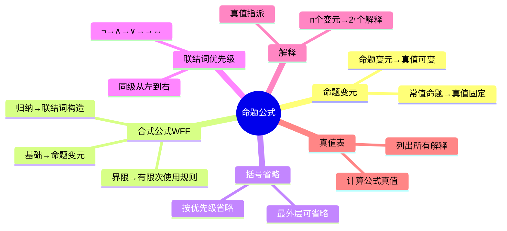

---
aliases:
  - 命题公式
  - 合式公式
  - WFF
  - Well-Formed Formula
---

# 3.3.1 命题公式

> [!abstract] 概述
> 本节介绍命题公式的形式化定义、合式公式的递归构造规则，以及真值表的概念和建立方法。

**所属**：[[3.3 命题公式与真值表]] | [[第3章 命题逻辑]]

---

## 一、命题变元（重点 ★★）

> [!definition] 定义3.3.1
> 一个特定的命题是一个**常值命题**，它不是具有真值"真"，就是具有真值"假"。
>
> 一个**任意的不指定真值的命题**称为**命题变元**(propositional variable)。
>
> - 用大写字母 $P, Q, R, \dots$ 等表示命题变元
> - 命题变元无具体的真值，其真值可以变化

> [!note] 理解
> - **常值命题**：如"太阳是圆的"，真值固定为"真"
> - **命题变元**：如 $P$，真值可以是"真"或"假"，类似于代数中的变量

---

## 二、合式公式的定义（重点 ★★★）

> [!definition] 定义3.3.2 命题演算的合式公式(WFF)
> **合式公式**(Well-Formed Formula, WFF)的递归定义如下：
>
> **(1)** 单个命题变元是合式公式；
>
> **(2)** 如果 $P$ 是合式公式，则 $\neg P$ 也是合式公式；
>
> **(3)** 如果 $P, Q$ 是合式公式，则 $(P \land Q)$、$(P \lor Q)$、$(P \to Q)$、$(P \leftrightarrow Q)$ 也都是合式公式；
>
> **(4)** 只有有限次地使用 (1)、(2)、(3) 组成的符号串才是合式公式。

> [!important] 规则要点
> - 规则 (1) 是**基础**：命题变元是最简单的合式公式
> - 规则 (2)(3) 是**归纳**：通过联结词构造更复杂的公式
> - 规则 (4) 是**界限**：只有按上述规则构造的才是合式公式

---

## 三、括号省略约定

> [!note] 省略规则
> 为了简化公式的书写，约定以下括号省略规则：
>
> 1. **公式最外层的括号可以省略**
>    - $(P \land Q)$ 可写成 $P \land Q$
>
> 2. **按联结词优先级省略括号**
>    - 优先级：$\neg \to \land \to \lor \to \to \to \leftrightarrow$
>    - 高优先级先运算，可不加括号

> [!example] 括号省略示例
> - $(P \land Q) \lor R$ 可写成 $P \land Q \lor R$（因为 $\land$ 优先于 $\lor$）
> - $P \to (Q \to R)$ 可写成 $P \to Q \to R$（右结合）
> - $(P \to Q) \land (Q \to R)$ 不能省略（$\land$ 优先于 $\to$）

---

## 四、联结词优先级（重点 ★★★）

> [!summary] 优先级规则（从高到低）
>
> | 优先级 | 联结词 | 说明 |
> |:------:|:------:|:----:|
> | 1 | $\neg$ | 否定（最高） |
> | 2 | $\land$ | 合取 |
> | 3 | $\lor$ | 析取 |
> | 4 | $\to$ | 蕴涵 |
> | 5 | $\leftrightarrow$ | 等价（最低） |

> [!tip] 记忆口诀
> **非合析蕴等**（否定 → 合取 → 析取 → 蕴涵 → 等价）

> [!warning] 同级运算
> 同级联结词按**从左到右**的顺序运算。

---

## 五、解释的概念

> [!definition] 定义3.3.3 解释
> 设 $P_1, P_2, \dots, P_n$ 是出现在公式 $G$ 中的所有命题变元，对 $P_1, P_2, \dots, P_n$ 指定一组真值，称为对 $G$ 的一个**解释**(explanation)或**真值指派**(assignment)。

> [!note] 说明
> - 对于有 $n$ 个命题变元的公式，共有 **$2^n$** 个不同的解释
> - 每个解释使公式取一个确定的真值

> [!example] 示例
> 公式 $P \land Q$ 有 2 个命题变元，共有 $2^2 = 4$ 个解释：
> - 解释1：$P=1, Q=1$
> - 解释2：$P=1, Q=0$
> - 解释3：$P=0, Q=1$
> - 解释4：$P=0, Q=0$

---

## 六、真值表（重点 ★★★）

> [!definition] 定义3.3.4 真值表
> 将公式 $G$ 在所有解释下的取值情况列成的表，称为 $G$ 的**真值表**(truth table)。

> [!important] 真值表构造步骤
> 1. **确定命题变元个数 $n$**
> 2. **列出所有 $2^n$ 个解释**（通常按二进制顺序）
> 3. **对每个解释计算公式的真值**
> 4. **将结果填入表格**

---

## 七、例题：构造真值表（重点 ★★★）

> [!example] 例3.3.1 构造下列公式的真值表
> (1) $G_1 = P \to Q$
> (2) $G_2 = \neg P \lor Q$
> (3) $G_3 = P \land \neg Q$

### 7.1 真值表构造

> [!summary] 表3.3.1 - 表3.3.3

**表3.3.1 $G_1 = P \to Q$ 的真值表**

| $P$ | $Q$ | $P \to Q$ |
|:---:|:---:|:---------:|
| 0 | 0 | 1 |
| 0 | 1 | 1 |
| 1 | 0 | 0 |
| 1 | 1 | 1 |

**表3.3.2 $G_2 = \neg P \lor Q$ 的真值表**

| $P$ | $Q$ | $\neg P$ | $\neg P \lor Q$ |
|:---:|:---:|:--------:|:---------------:|
| 0 | 0 | 1 | 1 |
| 0 | 1 | 1 | 1 |
| 1 | 0 | 0 | 0 |
| 1 | 1 | 0 | 1 |

**表3.3.3 $G_3 = P \land \neg Q$ 的真值表**

| $P$ | $Q$ | $\neg Q$ | $P \land \neg Q$ |
|:---:|:---:|:--------:|:----------------:|
| 0 | 0 | 1 | 0 |
| 0 | 1 | 0 | 0 |
| 1 | 0 | 1 | 1 |
| 1 | 1 | 0 | 0 |

### 7.2 复杂公式的真值表

> [!example] 构造 $(P \to Q) \land (Q \to R)$ 的真值表
> 有 3 个命题变元，共 $2^3 = 8$ 个解释

| $P$ | $Q$ | $R$ | $P \to Q$ | $Q \to R$ | $(P \to Q) \land (Q \to R)$ |
|:---:|:---:|:---:|:---------:|:---------:|:---------------------------:|
| 0 | 0 | 0 | 1 | 1 | 1 |
| 0 | 0 | 1 | 1 | 1 | 1 |
| 0 | 1 | 0 | 1 | 0 | 0 |
| 0 | 1 | 1 | 1 | 1 | 1 |
| 1 | 0 | 0 | 0 | 1 | 0 |
| 1 | 0 | 1 | 0 | 1 | 0 |
| 1 | 1 | 0 | 1 | 0 | 0 |
| 1 | 1 | 1 | 1 | 1 | 1 |

---

## 八、本节总结

---

#离散数学 #命题逻辑 #命题公式 #真值表 #重点
