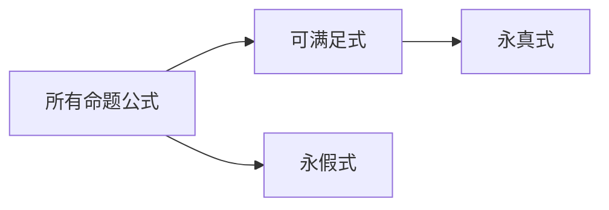

---
aliases:
  - 公式分类
  - 重言式与矛盾式
---

# 3.3.3 命题公式的分类

> [!abstract] 概述
> 根据真值表的不同情况，命题公式可分为永真式（重言式）、永假式（矛盾式）和可满足式三类。这是命题逻辑中的基本分类方式。

**所属**：[[3.3 命题公式与真值表]]

---

## 一、主要概念

### 1.1 三种公式类型 ★★★

> [!definition] 定义
> 根据公式在所有解释下的真值情况，可将命题公式分为三类：
>
> 1. **永真式（重言式）**：公式在所有可能的解释下真值都为真（1）
> 2. **永假式（矛盾式）**：公式在所有可能的解释下真值都为假（0）
> 3. **可满足式**：至少存在一个解释使公式真值为真（1）

### 1.2 三者关系 ★★

> [!theorem] 定理
> - 永真式一定是可满足式，但可满足式不一定是永真式
> - 永假式不是可满足式
> - 公式 G 是永真式 ⟺ 公式 ¬G 是永假式

三者关系可用集合表示：

### 1.3 判定问题 ★

> [!important] 重点
> **判定问题**：给定一个命题公式，判断它是永真式、永假式还是可满足式。
>
> **判定方法**：
> 1. 真值表法：列出所有解释，检查真值
> 2. 等值演算法：化简公式判断
> 3. 范式法：化为范式后判断

---

## 二、例题

### 例3.3.3 判断公式类型

> [!example] 例题
> 判断下列公式的类型：
> - $G_1 = (P \lor \neg P)$
> - $G_2 = (P \land \neg P)$
> - $G_3 = (P \rightarrow Q)$

**解**：使用真值表分析

| $P$ | $Q$ | $\neg P$ | $G_1 = P \lor \neg P$ | $G_2 = P \land \neg P$ | $G_3 = P \rightarrow Q$ |
|:---:|:---:|:--------:|:---------------------:|:----------------------:|:-----------------------:|
| 0 | 0 | 1 | 1 | 0 | 1 |
| 0 | 1 | 1 | 1 | 0 | 1 |
| 1 | 0 | 0 | 1 | 0 | 0 |
| 1 | 1 | 0 | 1 | 0 | 1 |

**结论**：
- $G_1$ 是**永真式**（所有真值都为1）
- $G_2$ 是**永假式**（所有真值都为0）
- $G_3$ 是**可满足式**（存在真值为1的情况，但不全为1）

---

## 三、易错点

> [!warning] 易错点
> 1. **混淆可满足式与永真式**：可满足式只需要至少一个解释为真，永真式要求所有解释都为真
> 2. **忘记检查所有解释**：判断类型时必须检查真值表的所有行
> 3. **否定关系**：永真式的否定是永假式，可满足式的否定不一定是什么特定类型

---

## 四、总结

| 类型 | 真值特点 | 示例 | 否定后类型 |
|:----:|:--------:|:----:|:----------:|
| 永真式 | 全为1 | $P \lor \neg P$ | 永假式 |
| 永假式 | 全为0 | $P \land \neg P$ | 永真式 |
| 可满足式 | 至少一个为1 | $P \rightarrow Q$ | 不确定 |

---

#第3章 #命题逻辑 #命题公式 #重点
