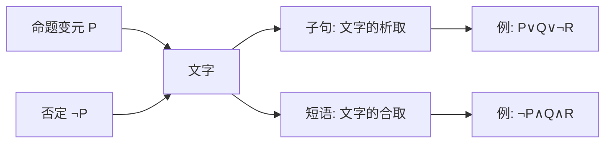
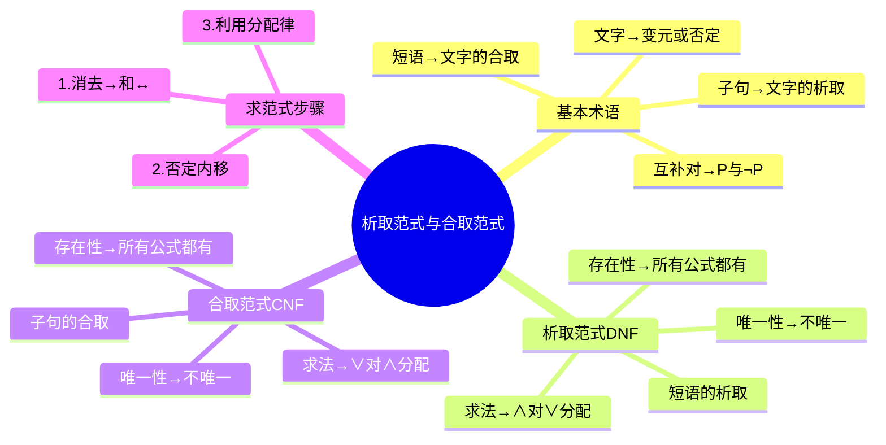

---
aliases:
  - 析取范式
  - 合取范式
  - DNF
  - CNF
  - Disjunctive Normal Form
  - Conjunctive Normal Form
  - 文字
  - 子句
  - 短语
---

# 3.5.1 析取范式和合取范式

> [!abstract] 概述
> 范式为命题公式提供了一种统一的表达形式。析取范式和合取范式是两种基本的范式形式，虽然它们不具有唯一性，但为进一步引入主范式（唯一标准形式）奠定基础。

**所属**：[[3.5 范式]] | [[第3章 命题逻辑]]

---

## 一、基本术语

### 1.1 文字、子句、短语 ★★★

> [!definition] 定义3.5.1
> （1）**文字**(literal)：命题变元或命题变元的否定；
>
> （2）**子句**(clause)：有限个文字的析取，也称为析取式；
>
> （3）**短语**(phrase)：有限个文字的合取，也称为合取式；
>
> （4）**互补对**：$P$ 与 $\neg P$ 称为互补对。

> [!example] 示例
> - $P$，$\neg P$ 是**文字、子句、短语**
> - $P \lor Q \lor \neg R$ 是**子句**
> - $\neg P \land Q \land R$ 是**短语**

> [!note] 注意
> 一个命题变元或者其否定既可以是简单的子句，也可以是简单的短语。

---

### 1.2 术语关系图 ★

---

## 二、析取范式与合取范式

### 2.1 定义 ★★★

> [!definition] 定义3.5.2
> （1）**析取范式**(disjunctive normal form)：有限个**短语**的**析取式**；
>
> （2）**合取范式**(conjunctive normal form)：有限个**子句**的**合取式**。

> [!example] 示例分析
>
> | 公式 | 是否析取范式 | 是否合取范式 | 说明 |
> |:----:|:------------:|:------------:|:----:|
> | $P$，$\neg P$ | ✓ | ✓ | 单个文字既是子句也是短语 |
> | $P \lor Q \lor \neg R$ | ✓ | ✓ | 单个子句/短语 |
> | $\neg P \land Q \land R$ | ✓ | ✓ | 单个短语/子句 |
> | $(P \land Q) \lor (\neg P \land Q)$ | ✓ | ✗ | 短语的析取 |
> | $(P \lor Q) \land (\neg P \lor Q)$ | ✗ | ✓ | 子句的合取 |
> | $P \lor (Q \lor \neg R)$ | ✗ | ✗ | 嵌套结构，需展开 |
> | $\neg(Q \lor R)$ | ✗ | ✗ | 否定未内移，需转换 |

> [!tip]- 为什么 $P \lor (Q \lor \neg R)$ 不是范式？
> 范式要求是"短语/子句的扁平化结构"，不能有嵌套的括号。
>
> 但 $P \lor (Q \lor \neg R) \Leftrightarrow P \lor Q \lor \neg R$（结合律），展开后既是析取范式也是合取范式。
>
> 同理，$\neg(Q \lor R) \Leftrightarrow \neg Q \land \neg R$（德摩根律），转换后既是析取范式也是合取范式。

---

### 2.2 范式的特点 ★★

> [!important] 范式的基本性质
> （1）单个的文字是子句、短语、析取范式、合取范式；
>
> （2）析取范式、合取范式**仅含联结词集** $\{\neg, \land, \lor\}$。

---

## 三、存在性定理

### 3.1 定理及证明 ★★★

> [!theorem] 定理3.5.1
> 对于任意命题公式，都存在与其等价的析取范式和合取范式。

> [!tip]- 证明思路（构造性证明）
> 由于联结词之间可以通过命题公式的基本等价关系进行相互转换，所以可以通过逻辑等价公式求出与其等价的析取范式和合取范式。
>
> **具体步骤**：
>
> **步骤(1) 消去 → 和 ↔**
>
> 利用如下等价关系：
> $$G \to H \Leftrightarrow \neg G \lor H$$
> $$G \leftrightarrow H \Leftrightarrow (G \to H) \land (H \to G) \Leftrightarrow (\neg G \lor H) \land (\neg H \lor G)$$
>
> **步骤(2) 否定内移**
>
> 重复使用德摩根律和双重否定律，将否定号 $\neg$ 移到各个命题变元的前端，并消去多余的否定号：
> $$\neg(\neg G) \Leftrightarrow G$$
> $$\neg(G \lor H) \Leftrightarrow \neg G \land \neg H$$
> $$\neg(G \land H) \Leftrightarrow \neg G \lor \neg H$$
>
> **步骤(3) 利用分配律**
>
> 重复利用分配律，将公式化成一些合取式的析取，或化成一些析取式的合取：
> $$G \lor (H \land S) \Leftrightarrow (G \lor H) \land (G \lor S) \quad \text{（求合取范式）}$$
> $$G \land (H \lor S) \Leftrightarrow (G \land H) \lor (G \land S) \quad \text{（求析取范式）}$$
>
> 对任意一个公式，经过步骤(1)、(2)、(3)后，必能化成与其等价的析取范式和合取范式。

---

### 3.2 求范式的步骤总结 ★★

> [!summary] 求析取范式 vs 求合取范式
>
> | 步骤 | 操作 | 求析取范式 | 求合取范式 |
> |:----:|:----:|:----------:|:----------:|
> | 1 | 消去 →, ↔ | ✓ | ✓ |
> | 2 | 否定内移 | ✓ | ✓ |
> | 3 | 分配律 | $\land$ 对 $\lor$ 分配 | $\lor$ 对 $\land$ 分配 |

---

## 四、例题

### 例3.5.1 求析取范式和合取范式 ★★★

> [!example] 题目
> 求公式 $(P \to Q) \lor (P \leftrightarrow R)$ 的析取范式和合取范式。

> [!tip] 分析
> （1）首先利用等价关系将联结词 $\to$ 和 $\leftrightarrow$ 去掉，化成仅含 $\neg, \land, \lor$ 的公式；
>
> （2）利用分配律进行分配，可得相应的合取范式；
>
> （3）进一步利用结合律、幂等律等进行合并，化成更加规范的合取范式；
>
> （4）展开后可得到相应的析取范式。

**解**：

$$
\begin{aligned}
& (P \to Q) \lor (P \leftrightarrow R) \\
\Leftrightarrow\ & (\neg P \lor Q) \lor ((\neg P \lor R) \land (\neg R \lor P)) \quad \text{（消去 →, ↔）} \\
\Leftrightarrow\ & ((\neg P \lor Q) \lor (\neg P \lor R)) \land ((\neg P \lor Q) \lor (\neg R \lor P)) \quad \text{（分配律）} \\
\Leftrightarrow\ & (\neg P \lor Q \lor \neg P \lor R) \land (\neg P \lor Q \lor \neg R \lor P) \quad \text{（结合律）} \\
\Leftrightarrow\ & (\neg P \lor Q \lor R) \land (\neg P \lor Q \lor \neg R \lor P) \quad \text{（幂等律化简）}
\end{aligned}
$$

> [!success] 结果
> - **合取范式**：$(\neg P \lor Q \lor R) \land (\neg P \lor Q \lor \neg R \lor P)$
> - **析取范式**：$\neg P \lor Q \lor R$（进一步化简后）

> [!note] 说明
> 求一个公式的析取范式和合取范式的步骤是一样的，但要根据具体情况选取合适的等价关系和分配律，以便形成相应的范式。

---

## 五、范式的不唯一性 ★★★

> [!important] 关键结论
> **析取范式和合取范式都不唯一！**
>
> 同一个公式可以有多种不同的析取范式（或合取范式）表示。

> [!example] 不唯一性示例
> 公式 $(P \lor Q) \land (P \lor R)$ 的析取范式可以是：
> - $P \lor (Q \land R)$
> - $(P \land P) \lor (Q \land R)$
> - $P \lor (Q \land \neg Q) \lor (Q \land R)$
> - $P \lor (P \land R) \lor (Q \land R)$
>
> 这些都是等价的析取范式！

> [!warning] 不唯一性带来的问题
> 这种不唯一的表达形式给研究问题带来了不便，为此需要引进**更为标准的范式**——主范式。

---

## 六、范式的应用

### 6.1 判断公式类型 ★★

> [!theorem] 定理3.5.3（见 [[3.5.4 范式的应用]]）
> （1）公式 $G$ 为**永真公式** $\Leftrightarrow$ 公式 $G$ 的合取范式中每个子句至少包含一个命题变元及其否定；
>
> （2）公式 $G$ 为**永假公式** $\Leftrightarrow$ 公式 $G$ 的析取范式中每个短语至少包含一个命题变元及其否定。

> [!example] 示例
> - $(P \lor \neg P) \land (Q \lor \neg Q)$ 是**永真式**（每个子句都含互补对）
> - $(P \land \neg P) \lor (Q \land \neg Q)$ 是**永假式**（每个短语都含互补对）

---

## 七、析取范式与合取范式的对比

| 项目 | 析取范式 (DNF) | 合取范式 (CNF) |
|:----:|:--------------:|:--------------:|
| 定义 | 有限个**短语**的**析取** | 有限个**子句**的**合取** |
| 基本单位 | 短语（文字的合取） | 子句（文字的析取） |
| 联结词 | $\neg, \land, \lor$ | $\neg, \land, \lor$ |
| 存在性 | 所有公式都存在 | 所有公式都存在 |
| 唯一性 | **不唯一** | **不唯一** |
| 求法关键 | $\land$ 对 $\lor$ 分配 | $\lor$ 对 $\land$ 分配 |
| 永假判定 | 每个短语含互补对 | — |
| 永真判定 | — | 每个子句含互补对 |

---

## 八、易错点

> [!warning] 易错点
> 1. **混淆子句和短语**
>    - 子句 = 文字的**析取**（$\lor$）
>    - 短语 = 文字的**合取**（$\land$）
>
> 2. **分配律方向错误**
>    - 求析取范式：$\land$ 对 $\lor$ 分配
>    - 求合取范式：$\lor$ 对 $\land$ 分配
>
> 3. **误以为范式唯一**
>    - 析取范式和合取范式都**不唯一**
>    - 只有**主范式**才唯一（见 [[3.5.2 主析取范式和主合取范式]]）
>
> 4. **忽略单个文字的情况**
>    - 单个文字 $P$ 既是子句，也是短语，既是析取范式，也是合取范式
>
> 5. **忘记否定内移**
>    - $\neg(Q \lor R)$ 不是范式，需转换为 $\neg Q \land \neg R$

---

## 九、本节总结

> [!tip] 学习建议
> 1. 熟练掌握等值演算的基本公式
> 2. 注意分配律的使用方向
> 3. 理解范式不唯一的原因，为学习主范式做准备

---

**下一节**：[[3.5.2 主析取范式和主合取范式]] - 引入唯一的标准形式

---

#第3章 #命题逻辑 #范式 #重点
