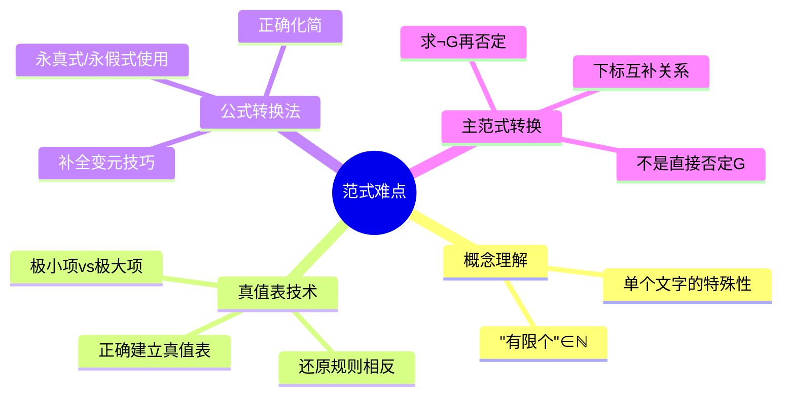

---
aliases:
  - 范式的难点
  - 范式易错点
---

# 3.5.3 范式的难点

> [!abstract] 概述
> 本节总结求范式过程中的常见难点和易错点，帮助读者避免典型错误。

**所属**：[[3.5 范式]] | [[第3章 命题逻辑]]

---

## 一、概念理解难点

### 1.1 "有限个"的理解 ★

> [!warning] 难点1：如何正确理解"有限个"
> 范式定义中的"有限个文字"、"有限个短语"、"有限个子句"的概念很关键。
>
> **"有限个"** $\in \mathbb{N} = \{0, 1, 2, \cdots, n, \cdots\}$
>
> 即有限个可以是 0 个、1 个、2 个、... 等自然数个。

> [!tip] 理解要点
> - **单个文字**既是子句，也是短语，既是析取范式，也是合取范式
> - **0 个**的情况：空析取式为永假式，空合取式为永真式
> - "有限"不等于"唯一"，范式形式不唯一

---

## 二、真值表技术难点

### 2.1 真值表建立与还原 ★★

> [!warning] 难点2：真值表技术的正确使用
> 使用真值表技术求主范式时要注意：
> 1. **正确地建立真值表**
> 2. **正确地掌握将真值解释还原成子句和短语的方法**

> [!tip] 还原规则
>
> | 目标 | 真值为 1 的行 | 真值为 0 的行 |
> |:----:|:-------------:|:-------------:|
> | **极小项** | 变元为 1 → 原变量；变元为 0 → 否定 | — |
> | **极大项** | — | 变元为 0 → 原变量；变元为 1 → 否定 |

> [!example] 还原示例
> 设 $P, Q$ 的解释为 $(P=0, Q=1)$：
> - 对应的**极小项**（真值为 1 的行）：$\neg P \land Q$
> - 对应的**极大项**（真值为 0 的行）：$P \lor \neg Q$

> [!warning] 常见错误
> 极小项和极大项的还原规则**相反**：
> - 极小项：0 → 否定，1 → 原变量
> - 极大项：0 → 原变量，1 → 否定

---

## 三、公式转换法难点

### 3.1 变元扩展 ★★

> [!warning] 难点3：正确增加命题变元
> 使用公式转换法求主范式时，需要增加某一个命题变元，此时要注意：
> 1. **正确加入该变元的永真公式和永假公式**
> 2. **注意正确化简公式**

> [!tip] 扩展技巧
>
> | 目标 | 扩展方法 | 使用的永真/永假式 |
> |:----:|:--------:|:-----------------:|
> | 求主析取范式 | 补全变元到合取式 | $P \Leftrightarrow P \land (Q \lor \neg Q)$ |
> | 求主合取范式 | 补全变元到析取式 | $P \Leftrightarrow P \lor (Q \land \neg Q)$ |

> [!example] 示例
> 将 $P \land Q$ 扩展为包含 $R$ 的极小项：
> $$P \land Q \Leftrightarrow P \land Q \land (R \lor \neg R) \Leftrightarrow (P \land Q \land R) \lor (P \land Q \land \neg R)$$

---

## 四、主范式转换难点

### 4.1 主析取范式与主合取范式的转换 ★★★

> [!warning] 难点4：利用主析取范式求主合取范式（或反之）
> 利用主析取范式求主合取范式或者利用主合取范式求主析取范式时，要注意：
>
> **是求 "$\neg G$" 的主析取范式的否定或 "$\neg G$" 的主合取范式的否定**
>
> **而非直接求公式 $G$ 的否定！**

> [!tip] 正确的转换步骤
>
> **已知 $G$ 的主析取范式，求 $G$ 的主合取范式**：
> 1. 求 $\neg G$ 的主析取范式 = $G$ 的主析取范式中**没有出现过**的极小项的析取
> 2. $G = \neg(\neg G)$ 即得 $G$ 的主合取范式
>
> **已知 $G$ 的主合取范式，求 $G$ 的主析取范式**：
> 1. 求 $\neg G$ 的主合取范式 = $G$ 的主合取范式中**没有出现过**的极大项的合取
> 2. $G = \neg(\neg G)$ 即得 $G$ 的主析取范式

> [!example] 示例
> 设 $G = m_0 \lor m_1 \lor m_3$（主析取范式），则：
> - $\neg G = m_2$（未出现的极小项）
> - $G = \neg(\neg G) = \neg m_2 = M_2$（主合取范式）

> [!warning] 常见错误
> ❌ 错误：直接对 $G$ 的主析取范式取否定
>
> ✓ 正确：先求 $\neg G$ 的主析取范式（用未出现的极小项），再取否定

---

## 五、下标互补关系 ★★

> [!tip] 下标互补规则
> 令：
> - $A = \{0, 1, 2, \cdots, 2^n - 1\}$
> - $B = \{i \mid i \text{ 是公式 } G \text{ 的主析取范式中极小项的下标}\}$
> - $C = \{i \mid i \text{ 是公式 } G \text{ 的主合取范式中极大项的下标}\}$
>
> 则有：$$C = A - B, \quad B = A - C$$

> [!note] 直观理解
> - 主析取范式使用的小项下标 + 主合取范式使用的大项下标 = 全部下标
> - 两者**互补**

---

## 六、难点总结

---

## 七、易错点速查表

| 难点 | 错误做法 | 正确做法 |
|:----:|:--------:|:--------:|
| 极小项还原 | 0 → 原变量 | 0 → 否定，1 → 原变量 |
| 极大项还原 | 1 → 原变量 | 1 → 否定，0 → 原变量 |
| 补全变元（求主析取范式） | $P \lor (Q \land \neg Q)$ | $P \land (Q \lor \neg Q)$ |
| 补全变元（求主合取范式） | $P \land (Q \lor \neg Q)$ | $P \lor (Q \land \neg Q)$ |
| 主范式转换 | 直接否定 $G$ | 先求 $\neg G$，再否定 |
| 小项/大项编号 | 认为相同 | 小项 $m_i$ 与大项 $M_i$ 编号规则相反 |

---

**上一节**：[[3.5.2 主析取范式和主合取范式]]
**下一节**：[[3.5.4 范式的应用]]

---

#第3章 #命题逻辑 #范式 #难点
