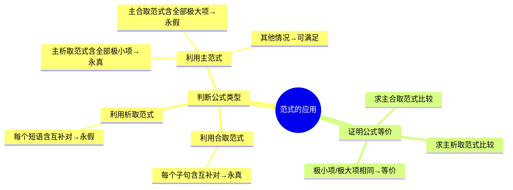

---
aliases:
  - 范式的应用
  - 判断公式类型
  - 证明公式等价
---

# 3.5.4 范式的应用

> [!abstract] 概述
> 范式有两个主要应用：判断命题公式的类型（永真、永假、可满足）以及证明两个公式之间的等价关系。

**所属**：[[3.5 范式]] | [[第3章 命题逻辑]]

---

## 一、判断公式类型

### 1.1 利用析取/合取范式判断 ★★★

> [!theorem] 定理3.5.3
> 利用析取范式和合取范式，可对命题公式的类型进行判断：
>
> （1）公式 $G$ 为**永真公式** $\Leftrightarrow$ 公式 $G$ 的**合取范式**中每个子句至少包含一个命题变元及其否定；
>
> （2）公式 $G$ 为**永假公式** $\Leftrightarrow$ 公式 $G$ 的**析取范式**中每个短语至少包含一个命题变元及其否定。

> [!tip] 记忆要点
>
> | 公式类型 | 使用的范式 | 判断条件 |
> |:--------:|:----------:|:--------:|
> | 永真式 | 合取范式 | 每个子句含互补对 |
> | 永假式 | 析取范式 | 每个短语含互补对 |
> | 可满足式 | — | 不满足上述两种条件 |

---

### 1.2 利用主范式判断 ★★

> [!theorem] 定理3.5.4
> 同样根据主析取范式和主合取范式，也可以判断公式的类型：
>
> （1）如果命题公式是**永真公式** $\Leftrightarrow$ 它的主析取范式包含**所有的极小项**，此时无主合取范式或者主合取范式为"空"；
>
> （2）如果命题公式是**永假公式** $\Leftrightarrow$ 它的主合取范式包含**所有的极大项**，此时无主析取范式或者说主析取范式为"空"；
>
> （3）如果命题公式是**可满足公式** $\Leftrightarrow$ 它的主析取范式非空且不包含所有极小项。

> [!summary] 判断方法对比
>
> | 方法 | 永真式 | 永假式 | 可满足式 |
> |:----:|:------:|:------:|:--------:|
> | 合取范式 | 每个子句含互补对 | — | — |
> | 析取范式 | — | 每个短语含互补对 | — |
> | 主析取范式 | 包含全部极小项 | 空 | 非空，非全部 |
> | 主合取范式 | 空 | 包含全部极大项 | 非空，非全部 |

---

## 二、证明公式等价

### 2.1 利用主范式证明等价 ★★★

> [!theorem] 定理3.5.4(3)
> 两个命题公式是**等价的** $\Leftrightarrow$ 它们对应的主析取范式之间等价，或者（可兼或）它们对应的主合取范式之间等价。

> [!tip] 证明步骤
> 1. 分别求出两个公式的主析取范式（或主合取范式）
> 2. 比较两个范式所含的极小项（或极大项）是否一样
> 3. 一样则两者等价，否则不等价

---

## 三、例题

### 例3.5.6 判断公式类型 ★★★

> [!example] 题目
> 判断下面公式为何种类型的公式：
>
> （1）$(P \land \neg Q) \leftrightarrow \neg(\neg P \lor Q)$
>
> （2）$(P \to Q) \to R$
>
> （3）$(P \to Q) \land (P \land \neg Q)$

> [!tip] 分析
> 首先利用基本的等价关系，将公式(1)、(2)、(3)分别转换成相应的析取范式或者合取范式，然后根据定理3.5.3可以判断出公式的类型。

---

**解（1）**：$(P \land \neg Q) \leftrightarrow \neg(\neg P \lor Q)$

$$
\begin{aligned}
& (P \land \neg Q) \leftrightarrow \neg(\neg P \lor Q) \\
\Leftrightarrow\ & ((P \land \neg Q) \to \neg(\neg P \lor Q)) \land (\neg(\neg P \lor Q) \to (P \land \neg Q)) \\
\Leftrightarrow\ & (\neg(P \land \neg Q) \lor \neg(\neg P \lor Q)) \land ((\neg P \lor Q) \lor (P \land \neg Q)) \\
\Leftrightarrow\ & ((\neg P \lor Q) \lor (P \land \neg Q)) \land ((\neg P \lor Q) \lor (P \land \neg Q)) \\
\Leftrightarrow\ & (\neg P \lor Q \lor P) \land (\neg P \lor Q \lor \neg Q) \land (\neg P \lor Q \lor P) \land (\neg P \lor Q \lor \neg Q)
\end{aligned}
$$

> [!success] 结论
> 由于该合取范式中每个子句至少包含一个命题变元及其否定，由定理3.5.3知，该公式为**永真公式**。

---

**解（2）**：$(P \to Q) \to R$

**合取范式**：
$$
\begin{aligned}
& (P \to Q) \to R \\
\Leftrightarrow\ & \neg(\neg P \lor Q) \lor R \\
\Leftrightarrow\ & (P \land \neg Q) \lor R \\
\Leftrightarrow\ & (P \lor R) \land (\neg Q \lor R)
\end{aligned}
$$

**析取范式**：
$$
(P \land \neg Q) \lor R
$$

> [!success] 结论
> 由于该公式所对应的合取范式及析取范式都不满足定理3.5.3中的条件，所以它既不是永真公式，也不是永假公式，而是一个**可满足公式**。

---

**解（3）**：$(P \to Q) \land (P \land \neg Q)$

$$
\begin{aligned}
& (P \to Q) \land (P \land \neg Q) \\
\Leftrightarrow\ & (\neg P \lor Q) \land (P \land \neg Q) \\
\Leftrightarrow\ & (\neg P \land P \land \neg Q) \lor (Q \land P \land \neg Q)
\end{aligned}
$$

> [!success] 结论
> 由于该公式所对应的析取范式中的每一个短语都至少包含一个命题变元及其否定，根据定理3.5.3知，该公式是一个**永假公式**。

---

### 例3.5.7 证明公式等价 ★★

> [!example] 题目
> 利用求主合取范式来证明公式之间的等价关系：
> $$(P \to Q) \land (P \to R) \equiv P \to (Q \land R)$$

> [!tip] 分析
> 利用等价公式转换法，首先分别求出公式 $(P \to Q) \land (P \to R)$ 与公式 $P \to (Q \land R)$ 的主合取范式，然后比较两个公式的主合取范式所含的极大项是否一样，一样则两者等价，否则两者不等价。

**证明**：

**左边**：$(P \to Q) \land (P \to R)$
$$
\begin{aligned}
& (P \to Q) \land (P \to R) \\
\Leftrightarrow\ & (\neg P \lor Q) \land (\neg P \lor R)
\end{aligned}
$$

**右边**：$P \to (Q \land R)$
$$
\begin{aligned}
& P \to (Q \land R) \\
\Leftrightarrow\ & \neg P \lor (Q \land R) \\
\Leftrightarrow\ & (\neg P \lor Q) \land (\neg P \lor R)
\end{aligned}
$$

> [!success] 结论
> 两边的主合取范式相同，都是 $(\neg P \lor Q) \land (\neg P \lor R)$，因此两个公式**等价**。

---

## 四、应用总结

---

## 五、易错点

> [!warning] 易错点
> 1. **判断永真/永假使用的范式不同**
>    - 判断永真：用**合取范式**
>    - 判断永假：用**析取范式**
>
> 2. **可满足式不是永真式**
>    - 可满足式：存在使公式为真的解释
>    - 永真式：所有解释都使公式为真
>
> 3. **证明等价时需要完整展开**
>    - 不能只比较部分范式
>    - 必须展开到主范式才能准确比较

---

**上一节**：[[3.5.3 范式的难点]]

---

#第3章 #命题逻辑 #范式 #应用
