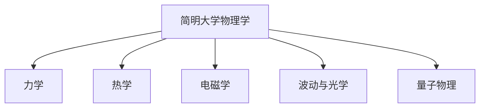

# 简明大学物理学

> 📚 范仰才、张欣、梁瑞生主编

## 快速开始

| 文件 | 说明 |
|------|------|
| [[笔记生成指南]] | 笔记格式、模板、规则 |
| [[生成指令]] | 快速生成笔记的指令 |
| [[页码索引]] | 所有小节的页码范围 |

## 目录结构

## 各篇目录

### 第一篇 力学
- [[第一章 质点运动学]]
- [[第二章 牛顿运动定律]]
- [[第三章 动量与角动量]]
- [[第四章 功和能]]
- [[第五章 刚体的转动]]

### 第二篇 热学
- [[第六章 气体动理论]]
- [[第七章 热力学基础]]

### 第三篇 电磁学
- [[第八章 静电场]]
- [[第九章 静电场中的导体和电介质]]
- [[第十章 恒定电流]]
- [[第十一章 真空中的磁场]]
- [[十二章 磁场中的磁介质]]
- [[第十三章 电磁感应]]

### 第四篇 波动与光学
- [[第十四章 振动]]
- [[第十五章 波动]]
- [[第十六章 光的干涉]]
- [[第十七章 光的衍射]]
- [[第十八章 光的偏振]]

### 第五篇 量子物理
- [[第十九章 量子物理基础]]

---

#学习笔记 #物理学
