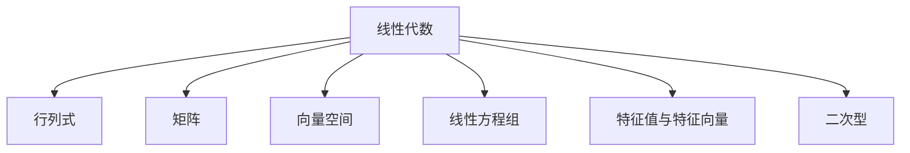

# 新工科数学：线性代数

> 📚 新工科系列教材

## 快速开始

| 文件 | 说明 |
|------|------|
| [[笔记生成指南]] | 笔记格式、模板、规则 |
| [[生成指令]] | 快速生成笔记的指令 |
| [[页码索引]] | 所有小节的页码范围 |

## 目录结构

## 各章目录

- [[第一章 行列式]]
- [[第二章 矩阵及其运算]]
- [[第三章 逆矩阵与矩阵的秩]]
- [[第四章 线性方程组]]
- [[第五章 向量组的线性相关性]]
- [[第六章 特征值与特征向量]]
- [[第七章 二次型]]

---

#学习笔记 #线性代数
