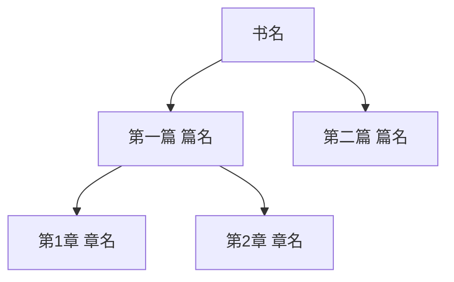

# 通用电子书笔记系统生成方案

> **目标**：创建一个适用于任意电子书的通用笔记生成框架，基于"离散数学及其应用"文件夹的完整结构复刻

---

## 一、系统概述

### 1.1 核心理念

将任意电子书转化为结构化的 Obsidian 笔记系统，实现：
- **层次化组织**：书 → 篇 → 章 → 节 → 小节
- **双向链接**：各层级之间完整的链接网络
- **进度追踪**：可视化的学习进度管理
- **可复用性**：一套模板适用于任意书籍

### 1.2 适用范围

- ✅ 计算机科学教材
- ✅ 数学教材
- ✅ 技术参考书籍
- ✅ 有明确章节结构的学术书籍

---

## 二、文件夹结构规范

### 2.1 完整目录树

```
[书名]/
│
├── 📄 README.md                    # 总索引 (MOC - Map of Content)
├── 📄 笔记生成指南.md              # 完整规则和模板
├── 📄 提示模板.md                  # AI生成笔记的提示词模板
├── 📄 生成指令.md                  # 快速指令参考
├── 📄 页码索引.md                  # PDF页码与书本页码对照表
│
├── 📁 目录/                        # 章节概览文件
│   ├── 第1章 [章节名].md
│   ├── 第2章 [章节名].md
│   └── ...
│
└── 📁 笔记/                        # 详细笔记内容
    │
    └── 📁 第1章 [章节名]/
        ├── 📄 README.md            # 章节索引
        │
        ├── 📁 1.1 [节名]/
        │   ├── 📄 1.1 [节名].md   # 节索引
        │   ├── 📄 1.1.1 [小节名].md
        │   ├── 📄 1.1.2 [小节名].md
        │   └── ...
        │
        └── 📁 1.2 [节名]/
            └── ...
```

### 2.2 层级说明

| 层级 | 命名格式 | 示例 | 说明 |
|:----:|:---------|:-----|:-----|
| 根目录 | `[书名]` | `算法导论` | 书籍主文件夹 |
| 章 | `第X章 [章名]` | `第3章 命题逻辑` | 对应书的章节 |
| 节 | `X.X [节名]` | `3.2 命题与命题联结词` | 章下的小节 |
| 小节 | `X.X.X [小节名]` | `3.2.1 命题` | 最细粒度内容 |

---

## 三、文件命名规范

### 3.1 通用规则

```
[编号] [名称].md
```

**示例**：
- `第3章 命题逻辑.md`
- `3.2 命题与命题联结词.md`
- `3.2.1 命题.md`

### 3.2 特殊文件

| 文件 | 固定名称 | 位置 |
|:----|:---------|:-----|
| 总索引 | `README.md` | 根目录 |
| 章节索引 | `README.md` | 每章文件夹内 |
| 节索引 | `[编号] [节名].md` | 节文件夹内 |
| 生成指南 | `笔记生成指南.md` | 根目录 |
| 提示模板 | `提示模板.md` | 根目录 |
| 生成指令 | `生成指令.md` | 根目录 |
| 页码索引 | `页码索引.md` | 根目录 |

---

## 四、文件内容模板

### 4.1 根目录 README.md

```markdown
# [书名]

> 📚 [简短描述]

## 快速开始

| 文件 | 说明 |
|------|------|
| [[笔记生成指南]] | 笔记格式、模板、规则 |
| [[生成指令]] | 快速生成笔记的指令 |
| [[页码索引]] | 所有小节的页码范围 |

## 目录结构



## 各篇目录

### 第一篇 [篇名]
- [[第1章 章名]]
- [[第2章 章名]]

---

#学习笔记 #[书名简写]
```

### 4.2 笔记生成指南.md

```markdown
# 笔记生成指南

> 此文件是笔记生成的完整指南，包含文件架构、模板格式、内容要求和链接规则

---

## 一、文件架构

（填写第二章的目录树结构）

---

## 二、层级规则

（填写第二章的层级说明表格）

---

## 三、笔记模板

### 小节笔记格式

```markdown
---
aliases:
  - 别名1
  - 别名2
---

# 编号 标题

> [!abstract] 概述
> 简要描述本节内容

**所属**：[[上级章节索引]]

---

## 一、主要概念

### 1.1 定义（重点 ★）

> [!definition] 定义
> 正式定义内容

### 1.2 性质/定理

> [!theorem] 定理
> 定理内容

---

## 二、例题

> [!example] 例题
> 题目与解答

---

## 三、易错点

> [!warning] 易错点
> 常见错误

---

## 四、总结

| 要点 | 内容 |
|:----:|:----:|

---

#标签
```

---

## 四、内容要求

### 必须包含
- [ ] 核心定义（用自己的话复述）
- [ ] 至少1个例子
- [ ] 与其他知识的关联

### 按需包含
- [ ] 公式推导
- [ ] 定理证明
- [ ] 典型例题
- [ ] 易错点提醒

---

## 五、命名与标签规范

### 命名规范
- 文件名：`[小节编号] [小节名称].md`

### 标签规范
- 章节标签：`#第X章`
- 主题标签：`#主题名`
- 难度标签：`#重点` `#难点`

---

## 六、链接规则

| 链接方向 | 说明 |
|:--------:|:----:|
| 小节 → 节 | 链接到直接上级 |
| 节 → 章 | 链接到直接上级 |
| 章 → MOC | 主干连回中心 |
| MOC → 各章 | 向下链接 |

---

## 七、标注规范

| Callout类型 | 用途 |
|:-----------:|:----:|
| `[!abstract]` | 概述 |
| `[!definition]` | 定义 |
| `[!theorem]` | 定理 |
| `[!example]` | 例题 |
| `[!warning]` | 易错点/注意 |
| `[!tip]` | 技巧/提示 |
| `[!important]` | 重点 |

### 重点标记
- `★` 一般重要
- `★★` 重要
- `★★★` 非常重要/必考
```

### 4.3 提示模板.md

```markdown
# AI笔记生成提示模板

## 使用说明

使用 AI（如 Claudian）根据以下模板生成学习笔记。

---

## ⚠️ 文件命名规范（重要）

AI 生成笔记时**必须**遵循以下命名规则：

| 层级 | 命名格式 | 示例 |
|------|----------|------|
| 章笔记 | `第X章 章名.md` | `第3章 命题逻辑.md` |
| 节笔记 | `第X章/X.X 节名.md` | `第3章/3.2 命题与命题联结词.md` |
| 小节笔记 | `第X章/X.X.X 小节名.md` | `第3章/3.2.1 命题.md` |

---

## 基础提示词

```
请根据《[书名]》课本，为 [[当前章节]] 生成学习笔记。

要求：
1. 按照目录结构填写每个小节的内容
2. 包含定义、定理、公式
3. 给出典型例题和解题思路
4. 标注重点和难点
5. 补充学习技巧和记忆方法
6. 文件命名必须用编号：如 "3.2.1 命题.md"
```

---

## 📋 直接复制使用的指令

### 生成单个小节笔记
```
请为《[书名]》生成 "X.X.X 小节名称" 的笔记。

要求：
1. 创建文件：[书名]/第X章/X.X.X 小节名称.md
2. 内容包括：定义、性质、例题、易错点
3. 使用 callout 格式标注重点
4. 文件名必须包含编号 "X.X.X"
```

### 批量生成章节笔记
```
请为《[书名]》第X章生成完整笔记。

要求：
1. 在 "[书名]/笔记/第X章/" 文件夹下创建
2. 每个小节单独一个文件，命名格式：X.X.X 小节名.md
3. 内容包含定义、定理、例题
```

---

## Callout 格式参考

```markdown
> [!def] 定义
> 定义内容

> [!thm] 定理
> 定理内容

> [!tip] 学习技巧
> 技巧内容

> [!warning] 易错点
> 注意事项

> [!example] 例题
> 例题内容
```
```

### 4.4 生成指令.md

```markdown
# 生成指令

> 快速生成笔记的指令模板

---

## PDF 信息

- **路径**：`[PDF文件路径]`
- **书名**：[书名]（[作者] [版本]）
- **页码偏移**：PDF页码 = 书本页码 + [偏移量]

---

## 快速指令

### 生成单个小节
```
生成 [小节编号] 的笔记
例如：生成 3.5.1 的笔记
```

### 批量生成
```
批量生成第[X]章的笔记
例如：批量生成第4章的笔记
```

---

## 相关文件

- [[笔记生成指南]] - 完整规则和模板
- [[页码索引]] - 所有小节的页码范围
- [[README]] - 总目录

---

## 注意事项

1. **页码偏移**：PDF 页码 ≠ 书本页码，需要 +[偏移量]
2. **增量生成**：建议按需生成，不要一次生成太多
3. **质量检查**：生成后检查格式是否符合 [[笔记生成指南]]
```

### 4.5 页码索引.md

```markdown
# [书名] - 页码索引

> **PDF路径**：`[PDF文件路径]`
> **页码偏移**：**PDF页码 = 书本页码 + [偏移量]**

---

## 快速使用

```
请读取 PDF 第[起始页]-[结束页]页，生成 [小节编号] [小节名称] 的笔记
```

### PDF页码计算
**PDF页码 = 书本页码 + [偏移量]**

| 书本页码 | PDF页码 |
|----------|---------|
| 43-50 | [计算后的页码] |
| 100-110 | [计算后的页码] |

---

## 第1章 [章名]

| 小节 | 书本页码 | PDF页码 | 状态 |
|------|----------|---------|------|
| 1.1.1 [小节名] | 5-10 | [计算] | ⬜ |
| 1.1.2 [小节名] | 11-15 | [计算] | ⬜ |

---

## 状态说明
- ⬜ 未生成
- ✅ 已生成
- 🔶 部分生成
```

### 4.6 目录/[第X章 章名].md

```markdown
# 第X章 [章名]

## X.1 [节名]
- X.1.1 [小节名]
- X.1.2 [小节名]

## X.2 [节名]
- X.2.1 [小节名]
- X.2.2 [小节名]

---

←[[第X-1章 章名]] | [[书名]] | [[第X+1章 章名]]→
```

### 4.7 笔记/[第X章 章名]/README.md

```markdown
# 第X章 [章名]

> [!abstract] 概述
> [本章内容简介]

**所属模块**：[[书名]]

---

## 📖 本章笔记

### X.1 [节名]

→ [[X.1 [节名]/X.1 [节名]]]

| 小节 | 标题 | 笔记 | 状态 |
|:----:|:----:|:----:|:----:|
| X.1.1 | [小节名] | [[X.1 [节名]/X.1.1 [小节名]]] | ✅ |
| X.1.2 | [小节名] | [[X.1 [节名]/X.1.2 [小节名]]] | ⬜ |

---

## 📊 学习进度

| 节 | 内容 | 完成度 |
|:-:|:----:|:------:|
| X.1 | [节名] | ✅ 已完成 |
| X.2 | [节名] | ⬜ 未开始 |

---

## 📌 本章重点

1. **[重点1]**
2. **[重点2]**
3. **[重点3]**

---

#[标签] #章节索引
```

### 4.8 笔记/[第X章]/[X.X 节名]/[X.X 节名].md

```markdown
# X.X [节名]

> [!abstract] 概述
> [本节简介]

**所属**：[[第X章 章名]]

---

## 小节目录

| 编号 | 标题 | 笔记 |
|:----:|:----:|:----:|
| X.X.1 | [小节名] | [[X.X.1 [小节名]]] |
| X.X.2 | [小节名] | [[X.X.2 [小节名]]] |

---

#标签
```

### 4.9 小节笔记模板 (X.X.X [小节名].md)

```markdown
---
aliases:
  - [别名1]
  - [别名2]
---

# X.X.X [小节名]

> [!abstract] 概述
> [本小节内容概述]

**所属**：[[X.X [节名]]] | [[第X章 [章名]]]

---

## 一、主要概念

### 1.1 定义（重点 ★）

> [!definition] 定义
> [正式定义内容]

> [!important] 理解要点
> [定义的解释和要点]

### 1.2 性质/定理

> [!theorem] 定理
> [定理内容]

---

## 二、例题

> [!example] 例题
> [题目与解答]

---

## 三、易错点

> [!warning] 易错点
> [常见错误]

---

## 四、总结

| 要点 | 内容 |
|:----:|:----:|
| 要点1 | [内容] |
| 要点2 | [内容] |

---

#标签
```

---

## 五、实施步骤

### 步骤1：初始化项目

1. 创建书籍根目录：`[书名]/`
2. 创建固定文件：
   - `README.md`
   - `笔记生成指南.md`
   - `提示模板.md`
   - `生成指令.md`
   - `页码索引.md`
3. 创建子目录：
   - `目录/`
   - `笔记/`

### 步骤2：分析书籍结构

1. 获取书籍目录（TOC）
2. 确定层级结构（篇/章/节/小节）
3. 记录页码偏移（如果使用PDF）
4. 填写 `页码索引.md`

### 步骤3：创建章节框架

1. 在 `目录/` 创建各章概览文件
2. 在 `笔记/` 创建各章文件夹和 README.md
3. 创建节和小节的文件夹结构

### 步骤4：生成笔记内容

**方式A：AI 辅助生成**
1. 使用 `提示模板.md` 中的提示词
2. 指定具体页码范围（从 `页码索引.md` 获取）
3. 让 AI 生成符合模板的笔记

**方式B：手动创建**
1. 按照模板结构手动编写
2. 使用 callout 标注重点
3. 添加双向链接

### 步骤5：质量检查

- [ ] 文件命名符合规范
- [ ] 层级链接完整
- [ ] callout 格式正确
- [ ] 标签统一规范
- [ ] 进度标记准确

---

## 六、页码索引填写指南

> 本章节解决"页码索引.md文件中有大量'? -?'占位符，不知道如何填写"的问题

### 6.1 确定页码偏移量

**什么是页码偏移？**

PDF阅读器显示的页码（PDF页码）可能与书本实际标注的页码（书本页码）不一致。这是由于PDF通常包含封面、版权页、目录等前置内容，导致正文第一页的PDF页码不是1。

**偏移量计算公式：**
```
偏移量 = PDF页码 - 书本页码
```

**确定偏移量的步骤：**

1. 打开PDF文件
2. 找到书本中标注页码为"第1页"的内容（通常是正文第一页）
3. 记录PDF阅读器显示的页码
4. 计算：偏移量 = PDF页码 - 1

**示例（离散数学及其应用）：**
```
书本第1页 → PDF显示第25页
偏移量 = 25 - 1 = 24
公式：PDF页码 = 书本页码 + 24
```

**验证偏移量：**
- 再找一个页码验证，如书本第43页应该对应PDF第67页（43+24=67）
- 如果匹配正确，说明偏移量计算准确

### 6.2 从PDF/书本获取页码信息

#### 方法A：扫描版PDF（图片格式）

1. 打开PDF阅读器
2. 翻阅每一页，查看页面底部的页码标注
3. 记录每个小节的起始和结束页码
4. 注意：有些扫描版可能没有页码标注，需要根据内容判断

#### 方法B：文字版PDF（可选择文本）

1. 打开PDF阅读器
2. 使用"目录"或"书签"功能（通常在左侧面板）
3. 大多数PDF自带目录会显示章节对应的页码
4. **注意**：PDF目录中的页码通常是"书本页码"，需要加上偏移量得到"PDF页码"

#### 方法C：扫描版PDF自动化提取（推荐）

当PDF为扫描版（无文本层）时，使用以下自动化方法：

**步骤1：检测PDF类型**
```python
import pdfplumber
with pdfplumber.open("[PDF路径]") as pdf:
    page = pdf.pages[0]
    print('Chars count:', len(page.chars))  # 0 = 扫描版
```

**步骤2：渲染目录页为图片**
```python
import fitz  # pymupdf
doc = fitz.open("[PDF路径]")
for page_num in [1, 2, 3]:  # 目录通常在第2-4页
    page = doc[page_num]
    pix = page.get_pixmap(matrix=fitz.Matrix(2, 2))  # 2x缩放提高识别率
    pix.save(f"toc_page_{page_num+1}.png")
doc.close()
```

**步骤3：视觉模型识别**
使用 `analyze_image` 工具识别图片中的目录文字：
```
请提取图片中的目录信息，格式：
章节号 章节名称 起始页码
```

**步骤4：计算页码偏移**
- 找到第一章起始页（书本页码1对应的PDF页码）
- 偏移量 = PDF页码 - 书本页码

**步骤5：生成索引表**
- 每小节起始页 = 上一小节结束页（首尾衔接）
- PDF页码 = 书本页码 + 偏移量

#### 方法D：使用AI辅助提取

```
请分析《[书名]》PDF，提取以下信息：
1. 各章节的起始和结束页码（书本页码）
2. 各小节的页码范围
3. 如果可能，直接输出填写好的页码索引表格

PDF路径：[PDF文件路径]
```

### 6.3 填写页码索引表

**填写步骤：**

1. **修改顶部信息**
   打开 `页码索引.md`，修改页码偏移量：
   ```markdown
   > **页码偏移**：**PDF页码 = 书本页码 + 24**  ← 填写实际偏移量
   ```

2. **逐个章节填写小节信息**

   | 字段 | 说明 | 示例 |
   |:----:|:-----|:-----|
   | 小节 | 小节编号和名称 | 3.2.1 命题 |
   | 书本页码 | 书中标注的页码范围 | 43-43 |
   | PDF页码 | 计算后的PDF页码 | 67-67（43+24） |
   | 状态 | ⬜未生成 / ✅已生成 / 🔶部分生成 | ✅ |

3. **PDF页码计算**
   - 单页：书本页码 + 偏移量 → 如 43+24=67，填"67-67"
   - 多页：起始+偏移量 - 结束+偏移量 → 如 44-49 填 "68-73"

4. **小节页码首尾相连（重要）**
   相邻小节的页码应该首尾重叠，即**下一小节的起始页 = 上一小节的结束页**：

   ```markdown
   | 小节 | 书本页码 | PDF页码 |
   |------|----------|---------|
   | 1.1 矩阵的定义 | 1-4 | 8-11 |
   | 1.2 矩阵的运算 | 4-10 | 11-17 |  ← 起始页=上一行结束页
   | 1.3 逆矩阵 | 10-16 | 17-23 |  ← 起始页=上一行结束页
   ```

   **好处**：
   - 确保页面覆盖完整，无遗漏
   - 便于按页码范围读取PDF时边界衔接

**完整示例（离散数学第3章）：**
```markdown
### 第3章 命题逻辑

| 小节 | 书本页码 | PDF页码 | 状态 |
|------|----------|---------|------|
| 3.2.1 命题 | 43-43 | 67-67 | ✅ |
| 3.2.2 命题联结词 | 44-49 | 68-73 | ✅ |
| 3.2.3 联结词的难点 | 50-50 | 74-74 | ✅ |
| 3.2.4 命题联结词的应用 | 51-54 | 75-78 | ✅ |
```

### 6.4 验证页码正确性

**验证方法：**

1. **抽查验证**：随机选择2-3个小节，跳转到对应PDF页码，确认内容是否匹配

2. **连续性检查**：确保相邻小节的页码是连续的（中间无断档）
   - 如：3.2.1结束于67页，3.2.2应该从68页开始

3. **边界检查**：确认每章第一个小节的页码与章节起始页一致

**使用AI验证：**
```
请验证《[书名]》页码索引中小节 "3.2.1 命题" 的页码是否正确。

PDF路径：[PDF路径]
书本页码：43-43
PDF页码：67-67
偏移量：24

请跳转到PDF第67页，确认内容是否为"命题"相关内容。
```

### 6.5 常见问题处理

| 问题 | 原因 | 解决方案 |
|------|------|----------|
| PDF页码与书本页码差距很大 | PDF包含封面、目录等前置内容 | 计算偏移量：PDF页码 = 书本页码 + 偏移 |
| 小节页码不连续 | 小节之间有练习/答案页 | 按实际内容填写，允许断档 |
| PDF没有页码标注 | 扫描版未标注页码 | 使用PDF阅读器页码作为参考，建立自己的映射 |
| 目录页码与实际不符 | PDF目录使用书本页码 | 记得加偏移量 |
| 找不到正文第1页 | 不清楚正文从哪页开始 | 找"第一章"标题所在页，通常就是正文 |

---

## 七、目录文件创建指南

> 本章节解决"目录/文件夹是空的，不知道如何创建章节概览文件"的问题

### 7.1 目录文件的作用

`目录/` 文件夹中的文件是**章节概览**，用于：

- **快速导航**：一眼看出每章包含哪些小节
- **章节入口**：作为进入笔记的门户
- **结构对应**：与 `笔记/` 文件夹中的详细笔记形成对应关系

**对应关系：**
```
目录/第3章 命题逻辑.md  ──→  章节概览（简单列表）
笔记/第3章 命题逻辑/    ──→  详细笔记（完整内容）
```

### 7.2 从书籍获取章节结构

#### 方法A：从PDF目录提取

1. 打开PDF阅读器
2. 查看"书签/目录"面板（通常在左侧）
3. 记录所有章节标题和编号
4. 整理成层级列表

#### 方法B：从书本目录页抄写

1. 打开PDF的目录页（通常在开头几页）
2. 按照书本目录结构记录
3. 整理成层级列表

#### 方法C：使用AI提取

```
请分析《[书名]》PDF的目录结构，列出所有章节和小节。

PDF路径：[PDF路径]

输出格式：
第X章 [章名]
  X.X [节名]
    X.X.X [小节名]
```

### 7.3 批量创建目录文件

**模板（每章一个文件）：**

```markdown
# 第X章 [章名]

## X.1 [节名]
- X.1.1 [小节名]
- X.1.2 [小节名]

## X.2 [节名]
- X.2.1 [小节名]
- X.2.2 [小节名]

---

←[[第X-1章 章名]] | [[书名]] | [[第X+1章 章名]]→
```

**批量创建步骤：**

1. 打开 `目录/` 文件夹
2. 为每章创建一个文件，命名为 `第X章 章名.md`
3. 按照模板填写内容
4. 添加前后章节的导航链接（底部导航）

**文件命名示例：**
```
目录/
├── 第1章 集合论.md
├── 第2章 计数问题.md
├── 第3章 命题逻辑.md
└── ...
```

### 7.4 目录文件示例

**完整示例（离散数学第3章）：**

```markdown
# 第3章 命题逻辑

## 3.2 命题与命题联结词
- 3.2.1 命题
- 3.2.2 命题联结词
- 3.2.3 联结词的难点
- 3.2.4 命题联结词的应用

## 3.3 命题公式
- 3.3.1 命题公式
- 3.3.2 命题公式的解释与真值表
- 3.3.3 命题公式的分类
- 3.3.4 命题公式的基本等价关系
- 3.3.5 命题公式的难点
- 3.3.6 命题公式的应用

## 3.4 联结词的完备集
- 3.4.1 命题联结词的种数
- 3.4.2 联结词的完备集
- 3.4.3 联结词的完备集的应用

## 3.5 范式
- 3.5.1 析取范式和合取范式
- 3.5.2 主析取范式和主合取范式
- 3.5.3 范式的难点
- 3.5.4 范式的应用

## 3.6 命题逻辑的推理
- 3.6.1 推理的基本概念和推理形式
- 3.6.2 判断有效结论的常用方法
- 3.6.3 命题逻辑推理的难点
- 3.6.4 命题逻辑推理的应用

---

←[[第2章 计数问题]] | [[离散数学及其应用]] | [[第4章 谓词逻辑]]→
```

### 7.5 目录与笔记的关联

**对应关系表：**

| 目录文件 | 笔记文件夹 | 关联方式 |
|:---------|:-----------|:---------|
| `目录/第3章 命题逻辑.md` | `笔记/第3章 命题逻辑/` | 目录提供概览，笔记包含详细内容 |

**从目录跳转到笔记（可选增强）：**

如果想让目录文件可以直接跳转到笔记，可以在目录中添加链接：

```markdown
# 第3章 命题逻辑

## 3.2 命题与命题联结词
→ [[笔记/第3章 命题逻辑/3.2 命题与命题联结词]]
- 3.2.1 命题 → [[笔记/第3章 命题逻辑/3.2 命题与命题联结词/3.2.1 命题]]
- 3.2.2 命题联结词 → [[笔记/第3章 命题逻辑/3.2 命题与命题联结词/3.2.2 命题联结词]]
```

**简化版本（推荐初期使用）：**

```markdown
# 第3章 命题逻辑

## 3.2 命题与命题联结词
- 3.2.1 命题
- 3.2.2 命题联结词
- 3.2.3 联结词的难点
- 3.2.4 命题联结词的应用

→ 详细笔记：[[笔记/第3章 命题逻辑/3.2 命题与命题联结词]]
```

---

## 八、自动化生成流程

### 6.1 准备阶段

```bash
# 输入信息
书名 = "[书籍名称]"
PDF路径 = "[PDF文件路径]"
页码偏移 = [数字]
目录结构 = [从书籍获取]
```

### 6.2 生成指令

对于任意小节，使用以下指令格式：

```
请为《[书名]》生成 "[X.X.X] [小节名称]" 的笔记。

要求：
1. 读取 PDF 第 [起始页]-[结束页] 页
2. 创建文件：[书名]/笔记/第X章/[X.X 节名]/[X.X.X 小节名].md
3. 按照 [笔记生成指南] 中的模板格式
4. 包含：概述、定义、定理、例题、易错点、总结
5. 使用 callout 格式标注
6. 添加正确的上级链接
```

### 6.3 批量生成

```
请为《[书名]》第X章生成完整笔记。

要求：
1. 读取目录：[目录文件路径]
2. 按照页码索引逐个生成小节笔记
3. 每个小节单独一个文件
4. 同时更新节索引文件和章 README.md
```

### 6.4 扫描版PDF按小节生成（推荐）

当PDF为扫描版时，按以下流程生成小节笔记：

**步骤1：渲染小节页面为图片**
```python
import fitz  # pymupdf
doc = fitz.open("[PDF路径]")

# 从页码索引获取小节页码范围
start_page = [起始PDF页码] - 1  # 转为0索引
end_page = [结束PDF页码] - 1

for page_num in range(start_page, end_page + 1):
    page = doc[page_num]
    pix = page.get_pixmap(matrix=fitz.Matrix(2, 2))
    pix.save(f"page_{page_num + 1}.png")
doc.close()
```

**步骤2：视觉模型识别内容**
使用 `analyze_image` 工具识别图片中的内容：
```
请识别图片中的教材内容，提取：
1. 定义和概念
2. 定理和公式
3. 例题和解答
4. 重点标注
```

**步骤3：生成笔记文件**
按照笔记模板格式，将识别的内容整理为 Markdown 笔记：
- 使用 callout 标注定义、定理、例题
- 添加上级链接
- 设置标签和 aliases

**快速指令示例：**
```
请为《[书名]》生成 "X.X.X [小节名称]" 的笔记。

PDF路径：[PDF路径]
页码范围：[起始页]-[结束页]（PDF页码）

要求：
1. 渲染PDF页面为图片并识别内容
2. 创建文件：[书名]/笔记/第X章/[X.X 节名]/[X.X.X 小节名].md
3. 按照 [笔记生成指南] 中的模板格式
4. 包含：概述、定义、定理、例题、易错点、总结
```

---

## 九、适配不同书籍

### 7.1 结构调整

| 书籍类型 | 结构特点 | 调整建议 |
|:--------|:---------|:---------|
| 有篇结构 | 篇→章→节→小节 | 保持4级结构 |
| 无篇结构 | 章→节→小节 | 跳过篇层级 |
| 仅章结构 | 章→小节 | 节层级可选 |

### 7.2 内容类型适配

| 内容类型 | 模板调整 |
|:--------|:---------|
| 概念型 | 强调定义、性质 |
| 算法型 | 增加算法步骤、复杂度分析 |
| 应用型 | 增加应用场景、案例 |
| 证明型 | 增加证明过程、推理链 |

---

## 十、关键文件清单

创建新书籍时，需要准备的核心文件：

| 序号 | 文件名 | 类型 | 必需 |
|:----:|:------|:----:|:----:|
| 1 | README.md | 根索引 | ✅ |
| 2 | 笔记生成指南.md | 规则文档 | ✅ |
| 3 | 提示模板.md | AI提示词 | ✅ |
| 4 | 生成指令.md | 快速参考 | ✅ |
| 5 | 页码索引.md | 页码对照 | ✅ |
| 6 | 目录/[各章].md | 章节概览 | ✅ |
| 7 | 笔记/[各章]/README.md | 章节索引 | ✅ |
| 8 | 笔记/[各章]/[各节]/[节索引].md | 节索引 | ✅ |
| 9 | 笔记/[各章]/[各节]/[各小节].md | 内容笔记 | ✅ |

---

## 十一、验证清单

完成笔记生成后，检查以下项目：

### 结构完整性
- [ ] 所有层级文件夹已创建
- [ ] 所有索引文件已创建
- [ ] 命名符合规范

### 链接完整性
- [ ] 小节链接到上级节
- [ ] 节链接到上级章
- [ ] 章链接到根 MOC
- [ ] MOC 链接到所有章

### 内容完整性
- [ ] 每个小节有概述
- [ ] 定义使用 callout
- [ ] 例题使用 callout
- [ ] 重点有星级标记

### 元数据完整性
- [ ] aliases 设置正确
- [ ] tags 统一规范
- [ ] 进度标记准确

---

## 十二、示例参考

完整的示例结构参见：
- `c:/Users/lsq/Documents/Obsidian Vault/math/离散数学及其应用/`

重点参考文件：
- [笔记生成指南.md](c:/Users/lsq/Documents/Obsidian Vault/math/离散数学及其应用/笔记生成指南.md)
- [提示模板.md](c:/Users/lsq/Documents/Obsidian Vault/math/离散数学及其应用/提示模板.md)
- [页码索引.md](c:/Users/lsq/Documents/Obsidian Vault/math/离散数学及其应用/页码索引.md)
- 示例笔记：[3.2.1 命题.md](c:/Users/lsq/Documents/Obsidian Vault/math/离散数学及其应用/笔记/第3章 命题逻辑/3.2 命题与命题联结词/3.2.1 命题.md)
