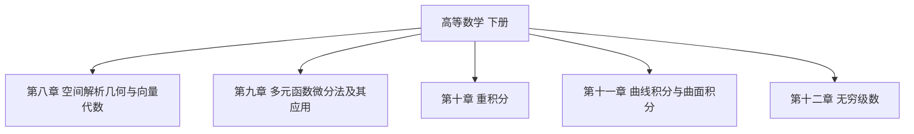

# 高等数学 下册

> 📚 同济大学数学科学学院编 · 第八版

## 快速开始

| 文件 | 说明 |
|------|------|
| [[笔记生成指南]] | 笔记格式、模板、规则 |
| [[生成指令]] | 快速生成笔记的指令 |
| [[页码索引]] | 所有小节的页码范围 |

## 目录结构

## 各章目录

- [[第八章 空间解析几何与向量代数]]
- [[第九章 多元函数微分法及其应用]]
- [[第十章 重积分]]
- [[第十一章 曲线积分与曲面积分]]
- [[第十二章 无穷级数]]

---

#学习笔记 #高等数学
